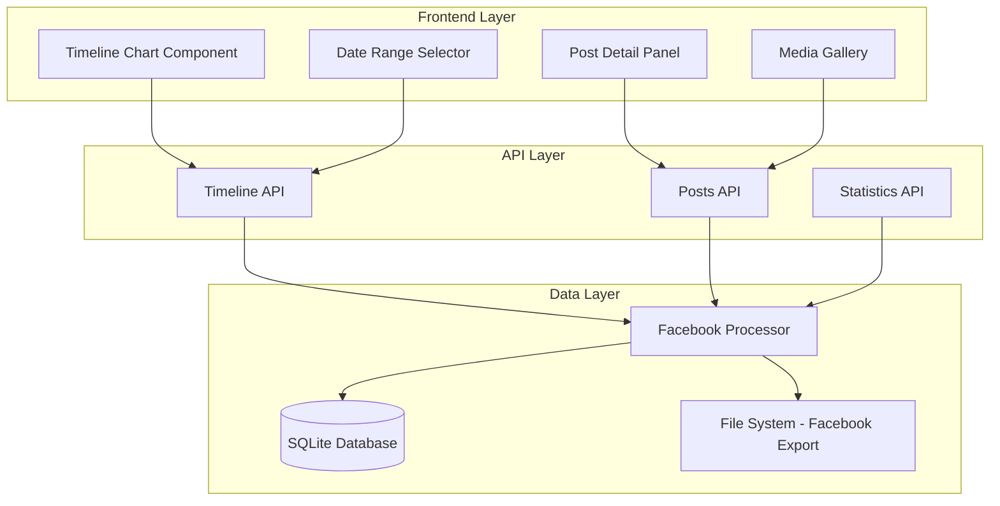

# Design Document

## Overview

The Facebook Posts Timeline system provides an interactive visualization of Facebook posts using a modern chart-based interface. The system consists of three main layers: a data processing layer that handles Facebook export data, a backend API layer that serves timeline data, and a frontend visualization layer that presents an interactive chart interface.

The architecture follows a separation of concerns pattern where data processing, API services, and UI components are loosely coupled. The system uses Chart.js for visualization, FastAPI for backend services, and React for the frontend interface.

## Architecture

The system follows a three-tier architecture:



The frontend components communicate with backend APIs through RESTful endpoints. The data layer processes Facebook export files and maintains a local database for efficient querying.

## Components and Interfaces

### Frontend Components

**TimelineChart Component**
- Renders interactive bar chart using Chart.js
- Handles user interactions (clicks, hovers)
- Manages chart state and updates
- Interface: `{ timelineData, onDateClick, selectedDateRange, onDateRangeChange }`

**PostDetailPanel Component**
- Displays posts for selected dates
- Renders post content and metadata
- Manages media thumbnail display
- Interface: `{ selectedDate, posts, onMediaClick }`

**DateRangeSelector Component**
- Provides date range filtering controls
- Handles granularity selection (daily/weekly/monthly)
- Interface: `{ dateRange, onRangeChange, granularity, onGranularityChange }`

**MediaGallery Component**
- Displays full-size media content
- Handles media navigation and zoom
- Interface: `{ mediaItems, selectedIndex, onClose }`

### Backend Components

**FacebookProcessor Class**
- Parses Facebook export JSON files
- Extracts and normalizes post data
- Manages database operations
- Interface: `process_facebook_data() -> ProcessingResult`

**Timeline API Endpoints**
- `GET /facebook/timeline` - Returns timeline data grouped by date
- `GET /facebook/posts` - Returns posts for date range
- `POST /facebook/process` - Triggers data processing
- `GET /facebook/stats` - Returns posting statistics

### Data Models

**FacebookPost Model**
```python
@dataclass
class FacebookPost:
    id: str
    content: str
    timestamp: datetime
    post_type: str  # 'status', 'photo', 'video', 'link'
    media_files: List[str]
    reactions: Dict[str, int]
    comments_count: int
    location: Optional[str]
    tagged_people: List[str]
```

**TimelineStats Model**
```python
@dataclass
class TimelineStats:
    date: str
    post_count: int
    media_count: int
    reaction_count: int
    post_types: Dict[str, int]
```

## Data Models

The system uses SQLite for local data storage with the following schema:

**facebook_posts table**
- `id` (TEXT PRIMARY KEY) - Unique post identifier
- `content` (TEXT) - Post text content
- `timestamp` (DATETIME) - Post creation timestamp
- `post_type` (TEXT) - Type of post (status, photo, video, link)
- `media_files` (TEXT) - JSON array of media file paths
- `reactions` (TEXT) - JSON object of reaction counts
- `comments_count` (INTEGER) - Number of comments
- `location` (TEXT) - Location name if available
- `tagged_people` (TEXT) - JSON array of tagged person names
- `created_at` (DATETIME) - Record creation timestamp

**Indexes**
- `idx_facebook_posts_timestamp` on `timestamp` for efficient date range queries
- `idx_facebook_posts_type` on `post_type` for filtering by content type

The database design supports efficient querying by date ranges and post types while maintaining referential integrity for media files and user interactions.
## Correctness Properties

*A property is a characteristic or behavior that should hold true across all valid executions of a system-essentially, a formal statement about what the system should do. Properties serve as the bridge between human-readable specifications and machine-verifiable correctness guarantees.*

Property 1: Post grouping by date consistency
*For any* set of Facebook posts with timestamps, grouping posts by date should result in each post appearing in exactly one date group, and the sum of posts across all groups should equal the original post count
**Validates: Requirements 1.2**

Property 2: Tooltip information accuracy
*For any* date bar in the timeline chart, hovering should display a tooltip containing the exact date and the correct count of posts for that date
**Validates: Requirements 1.3**

Property 3: Date selection post retrieval
*For any* date that contains posts, clicking on that date's bar should load and display all posts that have timestamps falling within that date
**Validates: Requirements 2.1**

Property 4: Post display completeness
*For any* post being displayed, the rendered output should contain the post content, timestamp, and media indicators if media exists
**Validates: Requirements 2.2**

Property 5: Media attachment visualization
*For any* post that contains media attachments, the display should show thumbnail previews and a badge indicating the correct count of media items
**Validates: Requirements 2.3**

Property 6: Media gallery integration
*For any* media thumbnail that is clicked, the system should open the full-size media in a gallery view
**Validates: Requirements 2.4**

Property 7: Loading state indication
*For any* operation that loads posts for a selected date, a loading indicator should be displayed during the loading process
**Validates: Requirements 2.5**

Property 8: Date range filtering accuracy
*For any* valid date range selection, the timeline chart should display only posts whose timestamps fall within the specified range
**Validates: Requirements 3.1**

Property 9: Granularity regrouping consistency
*For any* change in granularity setting (daily, weekly, monthly), posts should be regrouped according to the new time period without losing or duplicating any posts
**Validates: Requirements 3.2**

Property 10: Weekly grouping correctness
*For any* set of posts when granularity is set to weekly, posts should be grouped by calendar week with labels showing the correct week ranges
**Validates: Requirements 3.3**

Property 11: Monthly grouping correctness
*For any* set of posts when granularity is set to monthly, posts should be grouped by calendar month with labels showing the correct month names
**Validates: Requirements 3.4**

Property 12: Facebook data parsing completeness
*For any* valid Facebook export JSON file, the parsing process should extract all post content, timestamps, and media references without data loss
**Validates: Requirements 4.1**

Property 13: Multi-format parsing robustness
*For any* valid Facebook export format, the system should successfully parse the data and extract posts regardless of the specific JSON structure used
**Validates: Requirements 4.2**

Property 14: Database storage integrity
*For any* processed Facebook posts, the data should be stored in the database with indexed timestamps and be retrievable through efficient queries
**Validates: Requirements 4.3**

Property 15: Error handling continuity
*For any* Facebook export data containing both valid and invalid posts, the system should process all valid posts while logging errors for invalid ones
**Validates: Requirements 4.4**

Property 16: Processing summary accuracy
*For any* completed Facebook data processing operation, the returned summary should accurately reflect the number of posts processed and any errors encountered
**Validates: Requirements 4.5**

Property 17: Statistics calculation accuracy
*For any* set of Facebook posts, the displayed statistics should correctly calculate total post count, date range, and posts with media count
**Validates: Requirements 5.1**

Property 18: Activity analysis correctness
*For any* set of Facebook posts, the system should correctly identify the most active posting date and calculate accurate average posts per time period
**Validates: Requirements 5.2**

Property 19: Post type categorization
*For any* collection of posts with different content types, the system should correctly categorize and count posts by type (status, photo, video, link)
**Validates: Requirements 5.3**

Property 20: Engagement metrics display
*For any* posts that contain reaction and engagement data, the system should accurately display the reaction counts and engagement metrics
**Validates: Requirements 5.4**

Property 21: Dynamic statistics updates
*For any* change in date range filters, the statistics should automatically recalculate and update to reflect only the filtered data
**Validates: Requirements 5.5**

Property 22: API error handling consistency
*For any* API request failure or timeout, the system should display appropriate error messages and provide retry functionality
**Validates: Requirements 7.2**

Property 23: Processing error logging
*For any* error that occurs during data processing, the system should log detailed error information while displaying user-friendly messages
**Validates: Requirements 7.5**

Property 24: Gallery integration consistency
*For any* post containing media that exists in the photo gallery, the system should correctly link to the existing gallery components for media viewing
**Validates: Requirements 8.2**

Property 25: AI service integration
*For any* timeline data when AI services are available, the system should properly format and provide post data as context for story generation and content analysis
**Validates: Requirements 8.3**

Property 26: User preference preservation
*For any* user accessing timeline features, the system should respect and apply existing user preferences and authentication states
**Validates: Requirements 8.4**

Property 27: Component notification consistency
*For any* update to timeline data, the system should notify all relevant application components that depend on Facebook post data
**Validates: Requirements 8.5**

## Error Handling

The system implements comprehensive error handling across all layers:

**Data Processing Errors**
- Invalid JSON format in Facebook export files
- Missing or corrupted post data
- Timestamp parsing failures
- Media file reference errors

**API Layer Errors**
- Database connection failures
- Query timeout errors
- Invalid request parameters
- Authentication and authorization errors

**Frontend Errors**
- Chart rendering failures
- Network connectivity issues
- Invalid user input
- Component state errors

**Error Recovery Strategies**
- Graceful degradation when services are unavailable
- Retry mechanisms for transient failures
- User-friendly error messages with actionable guidance
- Detailed logging for debugging and monitoring

## Testing Strategy

The testing strategy employs both unit testing and property-based testing to ensure comprehensive coverage:

**Unit Testing Approach**
- Test specific examples and edge cases
- Verify integration points between components
- Test error conditions and boundary values
- Validate UI component behavior with known inputs

**Property-Based Testing Approach**
- Use Hypothesis for Python backend testing
- Use fast-check for JavaScript frontend testing
- Configure each property-based test to run a minimum of 100 iterations
- Tag each property-based test with comments referencing the design document properties

**Property-Based Test Requirements**
- Each correctness property must be implemented by a single property-based test
- Tests must be tagged with format: '**Feature: facebook-posts-timeline, Property {number}: {property_text}**'
- Tests should generate realistic Facebook post data for comprehensive validation
- Property tests verify universal behaviors across all valid inputs

**Integration Testing**
- End-to-end testing of data processing pipeline
- API endpoint testing with various data scenarios
- Frontend component integration testing
- Cross-browser compatibility testing

**Test Data Generation**
- Generate realistic Facebook export JSON structures
- Create posts with various content types and media attachments
- Generate edge cases like empty posts, missing fields, and invalid timestamps
- Create large datasets to test performance characteristics

The dual testing approach ensures that unit tests catch specific bugs while property tests verify general correctness across the entire input space.