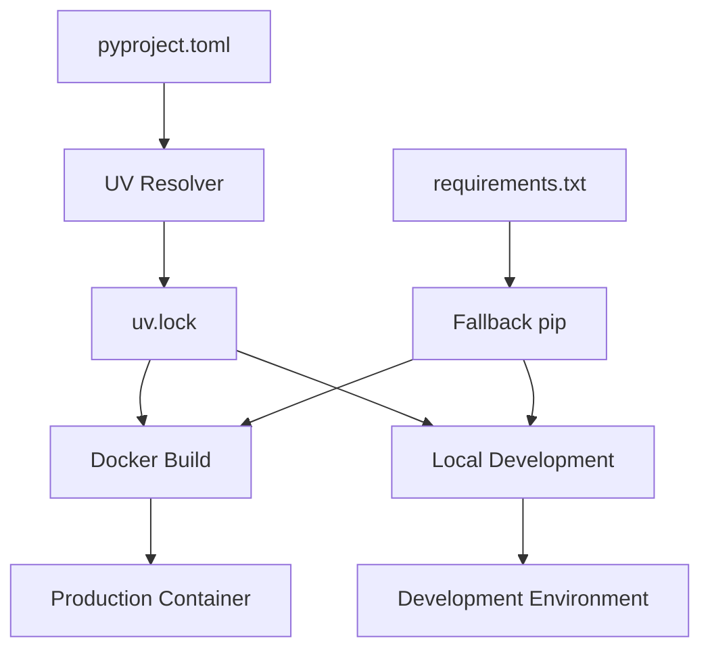

# UV Dependency Modernization Design

## Overview

This design modernizes the Personal Timeline application's dependency management by fully integrating UV (Ultra-fast Python package installer) to replace pip-based workflows. The solution maintains backward compatibility while providing significant performance improvements and better reproducibility through lockfiles.

## Architecture

The modernized dependency management follows a layered approach:



### Key Components

1. **Primary Path (UV)**: pyproject.toml → UV resolver → uv.lock → fast installation
2. **Fallback Path (pip)**: requirements.txt → pip resolver → standard installation
3. **Dual Support**: Both paths produce identical runtime environments

## Components and Interfaces

### UV Integration Layer
- **UV Lockfile Manager**: Generates and maintains uv.lock for reproducible builds
- **Docker UV Builder**: Modified Dockerfiles using UV for package installation
- **Local Development Scripts**: UV-based setup commands for developers

### Compatibility Layer
- **Requirements.txt Sync**: Keeps requirements.txt updated from pyproject.toml
- **Pip Fallback**: Maintains pip installation paths for legacy compatibility
- **Environment Detection**: Automatically chooses UV or pip based on availability

### Documentation Layer
- **Migration Guides**: Step-by-step transition instructions
- **Troubleshooting**: Common UV issues and solutions
- **Performance Metrics**: Before/after build time comparisons

## Data Models

### UV Configuration (pyproject.toml)
```toml
[tool.uv]
dev-dependencies = [
    "pytest>=8.0.0",
    "black>=23.0.0",
    "mypy>=1.5.0"
]

[tool.uv.sources]
# Optional: specify package sources if needed

[project]
dependencies = [
    # Core dependencies
]

[project.optional-dependencies]
ai = [
    # AI/ML dependencies
]
```

### Lockfile Structure (uv.lock)
- Exact version pins for all dependencies
- Dependency tree with resolution metadata
- Platform-specific constraints
- Hash verification for security

### Build Configuration
```dockerfile
# UV-optimized Dockerfile structure
FROM python:3.10-slim as builder
RUN curl -LsSf https://astral.sh/uv/install.sh | sh
COPY uv.lock pyproject.toml ./
RUN uv sync --frozen
```

## Correctness Properties

*A property is a characteristic or behavior that should hold true across all valid executions of a system-essentially, a formal statement about what the system should do. Properties serve as the bridge between human-readable specifications and machine-verifiable correctness guarantees.*

### Property 1: UV Installation Consistency
*For any* Docker build process, UV should be used for all package installations instead of pip, ensuring consistent tooling across builds
**Validates: Requirements 1.1**

### Property 2: Installation Speed Improvement
*For any* dependency set, UV installation should complete at least 5x faster than the equivalent pip operation while producing identical package versions
**Validates: Requirements 1.2**

### Property 3: Docker Architecture Compatibility
*For any* Docker build using the modernized system, the final image structure and runtime behavior should be identical to pip-based builds
**Validates: Requirements 1.3, 1.5**

### Property 4: Lockfile Generation and Usage
*For any* dependency resolution operation, the system should generate a UV lockfile with exact version pins and use it consistently for installations
**Validates: Requirements 2.1, 2.3**

### Property 5: Cross-Environment Reproducibility
*For any* environment using the same lockfile, dependency installation should produce identical package versions and dependency trees
**Validates: Requirements 2.2**

### Property 6: Lockfile Update Consistency
*For any* dependency update operation, the system should regenerate the lockfile with new version constraints while maintaining dependency tree validity
**Validates: Requirements 2.4**

### Property 7: Local Development Verification
*For any* local installation completion, all required dependencies should be available and importable in the Python environment
**Validates: Requirements 3.5**

### Property 8: Backward Compatibility Preservation
*For any* existing Docker Compose configuration, the modernized system should continue to function without requiring configuration changes
**Validates: Requirements 5.1**

### Property 9: Requirements.txt Compatibility
*For any* pip-based installation attempt, the system should maintain full compatibility with requirements.txt while providing equivalent functionality
**Validates: Requirements 5.2**

### Property 10: Legacy Script Support
*For any* legacy build script execution, the system should provide deprecation warnings while maintaining full functionality
**Validates: Requirements 5.3**

### Property 11: Configuration Respect
*For any* environment variable configuration, the system should respect existing patterns and maintain backward compatibility
**Validates: Requirements 5.4**

### Property 12: Rollback Safety
*For any* rollback operation to pip-based builds, the system should complete successfully without data loss or configuration corruption
**Validates: Requirements 5.5**

## Error Handling

### UV Installation Failures
- Detect UV availability during Docker build
- Automatic fallback to pip if UV installation fails
- Clear error messages with troubleshooting links

### Dependency Resolution Conflicts
- UV conflict resolution with detailed error reporting
- Lockfile regeneration procedures
- Manual override mechanisms for complex conflicts

### Platform Compatibility Issues
- Multi-platform lockfile support
- Architecture-specific dependency handling
- Graceful degradation for unsupported platforms

### Build Environment Issues
- Network connectivity problems during package downloads
- Disk space constraints during large dependency installations
- Memory limitations during dependency resolution

## Testing Strategy

### Unit Testing
- Test UV command generation and execution
- Validate lockfile parsing and validation
- Test fallback mechanisms when UV is unavailable
- Verify environment variable handling

### Property-Based Testing
- Generate random dependency sets and verify UV resolution consistency
- Test lockfile reproducibility across different environments
- Validate installation speed improvements with various package combinations
- Test backward compatibility with existing configuration variations

### Integration Testing
- Full Docker build tests with UV and pip paths
- Local development setup verification
- Cross-platform compatibility testing
- Performance benchmarking against current pip-based builds

### Performance Testing
- Measure build time improvements across different dependency sets
- Memory usage comparison between UV and pip installations
- Network efficiency testing for package downloads
- Concurrent build performance under load

**Property-based testing library**: We will use Hypothesis for Python to implement property-based tests. Each property-based test will run a minimum of 100 iterations to ensure thorough coverage of the input space.

**Test tagging**: Each property-based test will be tagged with comments explicitly referencing the correctness property using the format: '**Feature: uv-dependency-modernization, Property {number}: {property_text}**'