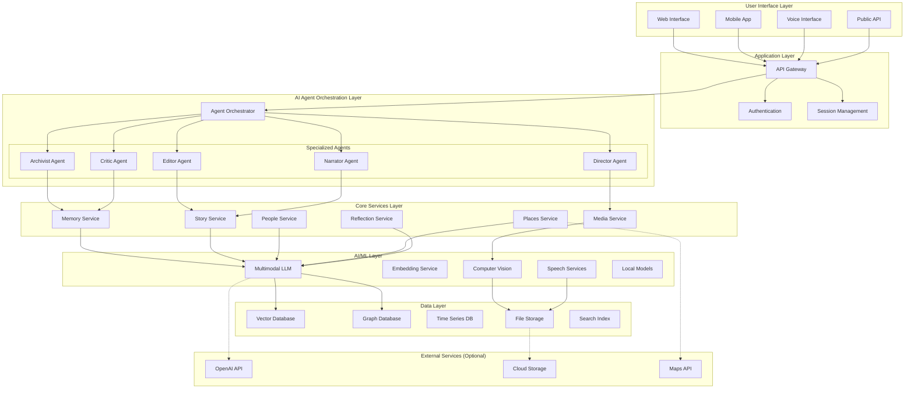
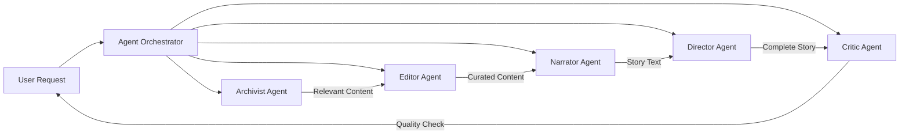
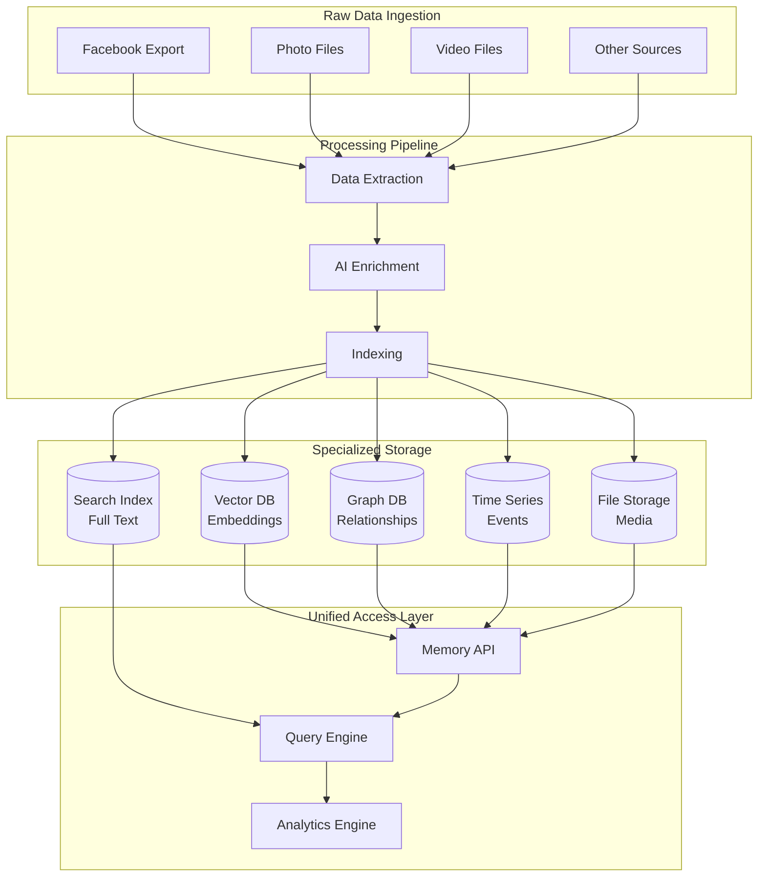
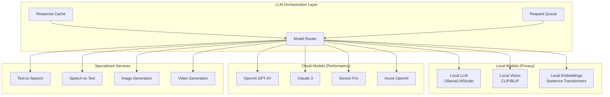
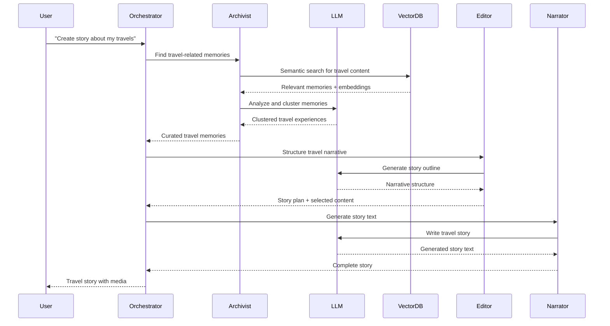
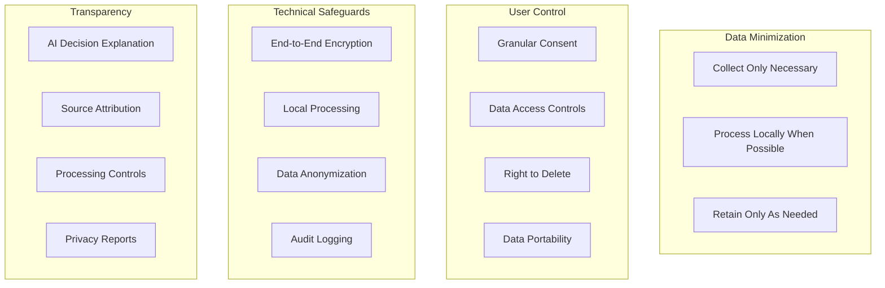
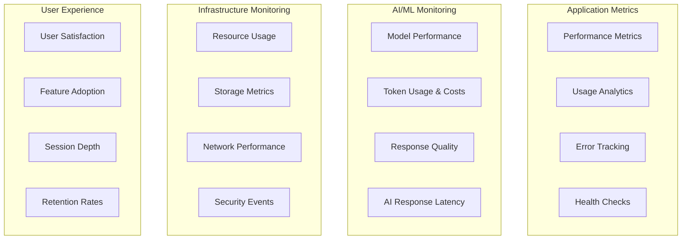
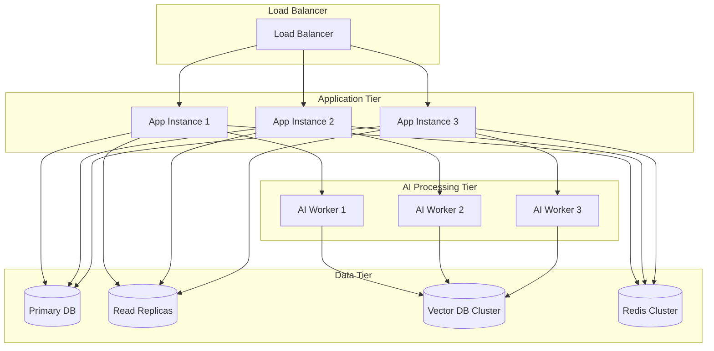
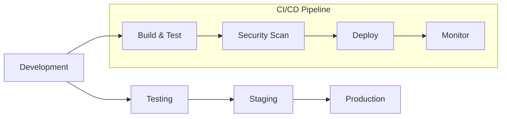

# System Architecture - AI-Augmented Personal Archive

**Date**: December 18, 2024  
**Vision**: AI-Augmented Personal Archive  
**Focus**: High-level system architecture and design decisions

---

## 🎯 Architecture Philosophy

The system architecture prioritizes **privacy, modularity, and AI-native design** while maintaining the ability to scale from local-only processing to cloud-enhanced experiences based on user preferences.

### Core Principles
- **Privacy First**: All sensitive processing can happen locally
- **AI Native**: Built around multimodal LLM capabilities from the ground up
- **Modular Design**: Components can be swapped, upgraded, or deployed separately
- **Progressive Enhancement**: Works offline, better with cloud services
- **Agent-Based**: Internal workflows use specialized AI agents
- **Data Sovereignty**: Users maintain complete control over their data

---

## 🏗️ High-Level System Architecture



---

## 🤖 AI Agent Architecture

### Agent Orchestration Pattern

The system uses **specialized AI agents** that work together to create high-quality, contextually appropriate experiences. Each agent has a specific role and expertise.



### Agent Specifications

#### 1. **Archivist Agent**
```yaml
Purpose: Content discovery and relevance assessment
Responsibilities:
  - Semantic search across all user data
  - Relevance scoring and ranking
  - Context understanding and expansion
  - Memory clustering and grouping
Inputs:
  - User queries (text, voice, visual)
  - Context from previous interactions
  - User preferences and filters
Outputs:
  - Ranked relevant memories
  - Context clusters
  - Relationship mappings
  - Temporal patterns
```

#### 2. **Editor Agent**
```yaml
Purpose: Content curation and narrative structure
Responsibilities:
  - Content selection and filtering
  - Narrative arc development
  - Emotional tone assessment
  - Sensitivity and appropriateness checking
Inputs:
  - Raw relevant content from Archivist
  - User story preferences
  - Emotional context requirements
  - Length and format constraints
Outputs:
  - Curated content selection
  - Narrative structure outline
  - Emotional tone guidelines
  - Content warnings if needed
```

#### 3. **Narrator Agent**
```yaml
Purpose: Text generation and voice narration
Responsibilities:
  - Story text generation
  - Voice narration script creation
  - Tone and style adaptation
  - Personalization and voice consistency
Inputs:
  - Curated content from Editor
  - Narrative structure and tone
  - User voice preferences
  - Story format requirements
Outputs:
  - Generated story text
  - Voice narration scripts
  - Chapter summaries
  - Contextual captions
```

#### 4. **Director Agent**
```yaml
Purpose: Media selection and story pacing
Responsibilities:
  - Photo/video selection for stories
  - Pacing and timing decisions
  - Visual narrative flow
  - Multi-modal story assembly
Inputs:
  - Story text from Narrator
  - Available media assets
  - User media preferences
  - Story format requirements
Outputs:
  - Selected media sequence
  - Timing and pacing instructions
  - Visual transition recommendations
  - Complete story assembly
```

#### 5. **Critic Agent**
```yaml
Purpose: Quality assurance and safety checking
Responsibilities:
  - Content accuracy verification
  - Emotional appropriateness assessment
  - Privacy and sensitivity checking
  - Quality and coherence evaluation
Inputs:
  - Complete story from Director
  - Original source materials
  - User privacy settings
  - Quality standards
Outputs:
  - Quality assessment report
  - Suggested improvements
  - Privacy compliance verification
  - Final approval or revision requests
```

---

## 🗄️ Data Architecture

### Multi-Modal Data Storage Strategy



### Database Selection Rationale

#### Vector Database (Embeddings & Semantic Search)
```yaml
Technology: Chroma / Weaviate / Pinecone
Purpose: Semantic similarity search
Data Types:
  - Text embeddings (posts, comments, captions)
  - Image embeddings (photos, visual content)
  - Multimodal embeddings (combined text+image)
  - Audio embeddings (voice notes, videos)
Use Cases:
  - "Find moments when I felt proud"
  - "Show me photos similar to this one"
  - "Memories about creativity"
```

#### Graph Database (Relationships & Connections)
```yaml
Technology: Neo4j / Amazon Neptune
Purpose: Relationship modeling and traversal
Data Types:
  - People relationships and interactions
  - Location connections and travel patterns
  - Event sequences and causality
  - Topic and interest networks
Use Cases:
  - "Who was I with most often in 2020?"
  - "How did my friendship with X evolve?"
  - "Places I visited with Y"
```

#### Time Series Database (Temporal Patterns)
```yaml
Technology: InfluxDB / TimescaleDB
Purpose: Time-based analytics and patterns
Data Types:
  - Activity frequency over time
  - Emotional patterns and trends
  - Posting behavior and engagement
  - Life phase transitions
Use Cases:
  - Activity heatmaps
  - Emotional journey visualization
  - Behavioral pattern analysis
```

#### File Storage (Media & Documents)
```yaml
Technology: MinIO / AWS S3 / Local filesystem
Purpose: Original media and generated content
Data Types:
  - Original photos and videos
  - Generated stories (text, audio, video)
  - Thumbnails and processed media
  - Export packages and backups
Use Cases:
  - Media serving and streaming
  - Story export and sharing
  - Backup and archival
```

#### Search Index (Full-Text Search)
```yaml
Technology: Elasticsearch / Solr
Purpose: Traditional text search and filtering
Data Types:
  - Post content and captions
  - Comments and reactions
  - Generated story text
  - Metadata and tags
Use Cases:
  - Keyword search
  - Date range filtering
  - People and location search
```

---

## 🧠 AI/ML Architecture

### Multimodal LLM Integration Strategy



### Model Selection Strategy

#### Privacy-First Approach
```yaml
Default Configuration:
  Text Processing: Local LLM (Llama 2/3, Mistral)
  Image Analysis: Local CLIP/BLIP models
  Embeddings: Local Sentence Transformers
  Voice: Local TTS/STT models

Advantages:
  - Complete privacy
  - No API costs
  - Offline capability
  - No rate limits

Trade-offs:
  - Slower processing
  - Higher hardware requirements
  - Limited model capabilities
```

#### Performance-Optimized Approach
```yaml
Hybrid Configuration:
  Complex Reasoning: Cloud LLMs (GPT-4, Claude)
  Simple Tasks: Local models
  Embeddings: Local (privacy) + Cloud (quality)
  Media Processing: Cloud APIs for quality

Advantages:
  - Best performance
  - Latest model capabilities
  - Faster processing
  - Better quality outputs

Trade-offs:
  - API costs
  - Internet dependency
  - Privacy considerations
```

### AI Processing Pipeline



---

## 🔐 Privacy & Security Architecture

### Privacy-by-Design Principles



### Security Implementation

#### Data Encryption Strategy
```yaml
At Rest:
  - AES-256 encryption for all stored data
  - Separate encryption keys per user
  - Hardware security module (HSM) for key management
  - Regular key rotation

In Transit:
  - TLS 1.3 for all network communications
  - Certificate pinning for API calls
  - End-to-end encryption for cloud sync
  - VPN support for enhanced privacy

In Processing:
  - Memory encryption during AI processing
  - Secure enclaves for sensitive operations
  - Temporary data cleanup after processing
  - No persistent logs of personal content
```

#### Access Control Framework
```yaml
Authentication:
  - Multi-factor authentication (MFA)
  - Biometric authentication support
  - Hardware security keys
  - Session management with timeout

Authorization:
  - Role-based access control (RBAC)
  - Granular permission system
  - API rate limiting
  - Request validation and sanitization

Audit & Monitoring:
  - Comprehensive audit logging
  - Anomaly detection
  - Privacy compliance monitoring
  - User activity transparency
```

---

## 🚀 Deployment Architecture

### Deployment Options

#### 1. **Local-Only Deployment**
```yaml
Target: Privacy-focused users
Components:
  - Docker Compose setup
  - Local LLM models
  - SQLite/PostgreSQL database
  - Local file storage
  - Web interface on localhost

Advantages:
  - Complete privacy
  - No ongoing costs
  - Offline capability
  - Full user control

Requirements:
  - 16GB+ RAM for local LLMs
  - 100GB+ storage for models and data
  - Modern CPU with good performance
```

#### 2. **Hybrid Deployment**
```yaml
Target: Balanced privacy and performance
Components:
  - Local core services
  - Optional cloud LLM APIs
  - Local data storage
  - Cloud backup (encrypted)
  - Progressive web app

Advantages:
  - Privacy for sensitive data
  - Performance for complex tasks
  - Reasonable resource requirements
  - Flexible configuration

Requirements:
  - 8GB+ RAM
  - 50GB+ storage
  - Internet connection for cloud features
```

#### 3. **Cloud-Enhanced Deployment**
```yaml
Target: Performance and convenience focused
Components:
  - Cloud-hosted application
  - Premium LLM APIs
  - Cloud databases
  - CDN for media delivery
  - Mobile and web apps

Advantages:
  - Best performance
  - Latest AI capabilities
  - Multi-device sync
  - Professional features

Requirements:
  - Subscription service
  - Internet connectivity
  - Trust in service provider
```

### Infrastructure as Code

#### Docker Compose Configuration
```yaml
version: '3.8'
services:
  app:
    build: .
    ports:
      - "3000:3000"
    environment:
      - NODE_ENV=production
      - DATABASE_URL=postgresql://user:pass@db:5432/timeline
    depends_on:
      - db
      - vector-db
      - redis
    
  db:
    image: postgres:15
    environment:
      - POSTGRES_DB=timeline
      - POSTGRES_USER=user
      - POSTGRES_PASSWORD=pass
    volumes:
      - postgres_data:/var/lib/postgresql/data
    
  vector-db:
    image: chromadb/chroma:latest
    ports:
      - "8000:8000"
    volumes:
      - chroma_data:/chroma/chroma
    
  redis:
    image: redis:7-alpine
    volumes:
      - redis_data:/data
    
  ollama:
    image: ollama/ollama:latest
    ports:
      - "11434:11434"
    volumes:
      - ollama_data:/root/.ollama
    
volumes:
  postgres_data:
  chroma_data:
  redis_data:
  ollama_data:
```

#### Kubernetes Deployment (Cloud)
```yaml
apiVersion: apps/v1
kind: Deployment
metadata:
  name: personal-timeline
spec:
  replicas: 3
  selector:
    matchLabels:
      app: personal-timeline
  template:
    metadata:
      labels:
        app: personal-timeline
    spec:
      containers:
      - name: app
        image: personal-timeline:latest
        ports:
        - containerPort: 3000
        env:
        - name: DATABASE_URL
          valueFrom:
            secretKeyRef:
              name: db-secret
              key: url
        resources:
          requests:
            memory: "2Gi"
            cpu: "1000m"
          limits:
            memory: "4Gi"
            cpu: "2000m"
```

---

## 📊 Monitoring & Observability

### Application Monitoring



### Key Metrics to Track

#### Technical Metrics
```yaml
Performance:
  - API response times
  - Database query performance
  - AI model inference latency
  - Memory and CPU usage
  - Storage utilization

Reliability:
  - Service uptime
  - Error rates by component
  - Failed request recovery
  - Data consistency checks

AI/ML Specific:
  - Model accuracy and relevance
  - Token consumption and costs
  - Response generation time
  - User satisfaction with AI outputs
```

#### User Experience Metrics
```yaml
Engagement:
  - Daily/monthly active users
  - Session duration and depth
  - Feature adoption rates
  - Story creation frequency

Quality:
  - User satisfaction scores
  - Story completion rates
  - Memory discovery success
  - Reflection engagement

Privacy:
  - Privacy setting usage
  - Local vs cloud processing ratios
  - Data export requests
  - User control utilization
```

---

## 🔄 Scalability Considerations

### Horizontal Scaling Strategy



### Performance Optimization

#### Caching Strategy
```yaml
Multi-Level Caching:
  L1 - Application Cache:
    - Frequently accessed memories
    - User preferences and settings
    - Generated story fragments
    
  L2 - Redis Cache:
    - AI model responses
    - Computed embeddings
    - Search results
    
  L3 - CDN Cache:
    - Static media files
    - Generated story videos
    - Public story content

Cache Invalidation:
  - Time-based expiration
  - Event-driven invalidation
  - User-triggered refresh
  - Smart cache warming
```

#### Database Optimization
```yaml
Read Optimization:
  - Read replicas for query distribution
  - Materialized views for complex queries
  - Partitioning by time and user
  - Optimized indexes for common patterns

Write Optimization:
  - Batch processing for bulk operations
  - Asynchronous processing for non-critical updates
  - Connection pooling and management
  - Write-through caching for hot data

Vector Database Optimization:
  - Hierarchical navigable small world (HNSW) indexes
  - Quantization for memory efficiency
  - Distributed sharding for large datasets
  - Approximate nearest neighbor search
```

---

## 🔧 Development & DevOps

### Development Workflow



### Technology Stack

#### Backend Services
```yaml
Core Application:
  - Node.js/TypeScript or Python/FastAPI
  - GraphQL API for flexible queries
  - WebSocket for real-time features
  - Background job processing (Bull/Celery)

AI/ML Integration:
  - LangChain for LLM orchestration
  - Transformers for local models
  - OpenAI/Anthropic SDKs for cloud models
  - Custom agent framework

Data Processing:
  - Apache Kafka for event streaming
  - Apache Airflow for workflow orchestration
  - Pandas/Polars for data manipulation
  - FFmpeg for media processing
```

#### Frontend Applications
```yaml
Web Application:
  - React/Next.js with TypeScript
  - Tailwind CSS for styling
  - Framer Motion for animations
  - PWA capabilities for offline use

Mobile Applications:
  - React Native for cross-platform
  - Native modules for device integration
  - Offline-first architecture
  - Voice interface integration

Voice Interface:
  - Web Speech API
  - Custom wake word detection
  - Natural language processing
  - Multi-language support
```

---

## 🎯 Architecture Decision Records (ADRs)

### ADR-001: Multimodal LLM Strategy
```yaml
Decision: Hybrid local/cloud LLM approach
Context: Balance between privacy and performance
Consequences:
  Positive:
    - User choice in privacy vs performance
    - Graceful degradation when offline
    - Cost optimization through local processing
  Negative:
    - Increased complexity
    - Higher local resource requirements
    - Model synchronization challenges
```

### ADR-002: Agent-Based Architecture
```yaml
Decision: Specialized AI agents for different tasks
Context: Need for high-quality, contextually appropriate outputs
Consequences:
  Positive:
    - Better quality through specialization
    - Easier testing and debugging
    - Modular and extensible design
  Negative:
    - Increased system complexity
    - Agent coordination overhead
    - More complex deployment
```

### ADR-003: Multi-Database Strategy
```yaml
Decision: Use specialized databases for different data types
Context: Optimize for different access patterns and use cases
Consequences:
  Positive:
    - Optimal performance for each use case
    - Scalability for different data types
    - Technology flexibility
  Negative:
    - Increased operational complexity
    - Data consistency challenges
    - Higher infrastructure costs
```

---

**System Architecture Date**: December 18, 2024  
**Status**: ✅ **System Architecture Complete**  
**Next**: Detailed technical implementation and task breakdowns