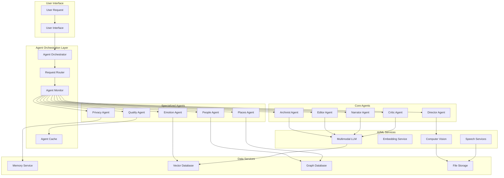
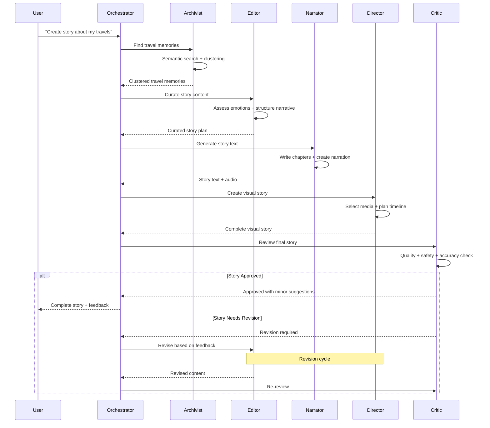

# AI Agent Framework - AI-Augmented Personal Archive

**Date**: December 18, 2024  
**Vision**: AI-Augmented Personal Archive  
**Focus**: Detailed AI agent architecture and implementation

---

## 🤖 Agent Framework Philosophy

The AI Agent Framework is the **heart of the AI-Augmented Personal Archive**. Instead of monolithic AI processing, we use **specialized agents** that collaborate to create high-quality, contextually appropriate, and emotionally intelligent experiences.

### Core Principles
- **Specialization**: Each agent has a specific expertise and responsibility
- **Collaboration**: Agents work together through well-defined interfaces
- **Quality Assurance**: Multi-stage review and refinement process
- **Emotional Intelligence**: Agents understand and respect emotional context
- **User Control**: Transparent operation with user oversight capabilities

---

## 🏗️ Agent Framework Architecture



---

## 🎭 Core Agent Specifications

### 1. **Archivist Agent** - *The Memory Keeper*

#### Purpose & Responsibilities
```yaml
Primary Role: Content discovery and relevance assessment
Core Responsibilities:
  - Semantic search across all user data
  - Memory clustering and pattern recognition
  - Context understanding and expansion
  - Relevance scoring and ranking
  - Temporal pattern analysis
  - Cross-reference relationship mapping

Personality Traits:
  - Thorough and methodical
  - Pattern-recognition focused
  - Context-aware
  - Historically minded
```

#### Technical Implementation
```python
class ArchivistAgent:
    def __init__(self, memory_service, vector_db, llm_service):
        self.memory_service = memory_service
        self.vector_db = vector_db
        self.llm_service = llm_service
        self.context_window = 10000  # tokens
        
    async def search_memories(self, query: str, context: dict) -> List[Memory]:
        """
        Perform semantic search with context awareness
        """
        # 1. Understand query intent and expand context
        expanded_query = await self.expand_query_context(query, context)
        
        # 2. Multi-modal semantic search
        embeddings = await self.generate_query_embeddings(expanded_query)
        candidates = await self.vector_db.similarity_search(
            embeddings, 
            k=50,  # Get more candidates for better filtering
            filters=self.build_context_filters(context)
        )
        
        # 3. Re-rank with LLM understanding
        ranked_memories = await self.llm_rerank_memories(
            query, candidates, context
        )
        
        # 4. Cluster related memories
        clustered_memories = await self.cluster_memories(ranked_memories)
        
        return clustered_memories
    
    async def expand_query_context(self, query: str, context: dict) -> str:
        """
        Use LLM to understand and expand query context
        """
        prompt = f"""
        User query: "{query}"
        Current context: {context}
        
        Expand this query to include:
        1. Related concepts and synonyms
        2. Temporal context (if relevant)
        3. Emotional context (if relevant)
        4. People context (if relevant)
        5. Location context (if relevant)
        
        Return expanded search terms and context.
        """
        
        response = await self.llm_service.generate(prompt)
        return response.expanded_query
    
    async def cluster_memories(self, memories: List[Memory]) -> List[MemoryCluster]:
        """
        Group related memories into meaningful clusters
        """
        # Use semantic similarity and temporal proximity
        clusters = []
        
        for memory in memories:
            # Find best cluster or create new one
            best_cluster = self.find_best_cluster(memory, clusters)
            if best_cluster and best_cluster.similarity_score > 0.7:
                best_cluster.add_memory(memory)
            else:
                clusters.append(MemoryCluster([memory]))
        
        # Generate cluster summaries
        for cluster in clusters:
            cluster.summary = await self.generate_cluster_summary(cluster)
            
        return clusters
```

#### Agent Prompts & Templates
```yaml
Search Understanding Prompt:
  template: |
    You are an expert archivist helping someone explore their personal memories.
    
    User query: "{query}"
    Available context: {context}
    
    Your task:
    1. Understand the emotional intent behind this query
    2. Identify key concepts, people, places, and time periods
    3. Consider what related memories might be meaningful
    4. Suggest search expansions that respect privacy and emotional sensitivity
    
    Respond with structured search parameters and emotional context.

Relevance Scoring Prompt:
  template: |
    Rate the relevance of this memory to the user's query:
    
    Query: "{query}"
    Memory: "{memory_content}"
    Context: {additional_context}
    
    Consider:
    - Direct relevance to query
    - Emotional resonance
    - Temporal relevance
    - People/place connections
    - Thematic similarity
    
    Score: 0.0-1.0 with explanation.
```

---

### 2. **Editor Agent** - *The Curator*

#### Purpose & Responsibilities
```yaml
Primary Role: Content curation and narrative structure
Core Responsibilities:
  - Content selection and filtering
  - Narrative arc development
  - Emotional tone assessment
  - Sensitivity and appropriateness checking
  - Story structure planning
  - Content flow optimization

Personality Traits:
  - Editorial judgment
  - Emotionally sensitive
  - Structure-focused
  - Quality-oriented
```

#### Technical Implementation
```python
class EditorAgent:
    def __init__(self, llm_service, emotion_agent, privacy_agent):
        self.llm_service = llm_service
        self.emotion_agent = emotion_agent
        self.privacy_agent = privacy_agent
        
    async def curate_story_content(
        self, 
        memories: List[MemoryCluster], 
        story_intent: StoryIntent
    ) -> CuratedStory:
        """
        Curate and structure content for story creation
        """
        # 1. Assess emotional context and sensitivity
        emotional_analysis = await self.emotion_agent.analyze_content_emotions(memories)
        
        # 2. Check privacy and sensitivity constraints
        privacy_assessment = await self.privacy_agent.assess_content_privacy(memories)
        
        # 3. Select appropriate content
        selected_content = await self.select_story_content(
            memories, story_intent, emotional_analysis, privacy_assessment
        )
        
        # 4. Develop narrative structure
        narrative_structure = await self.develop_narrative_arc(
            selected_content, story_intent
        )
        
        # 5. Plan content flow and pacing
        content_flow = await self.plan_content_flow(
            selected_content, narrative_structure
        )
        
        return CuratedStory(
            content=selected_content,
            structure=narrative_structure,
            flow=content_flow,
            emotional_context=emotional_analysis,
            privacy_notes=privacy_assessment
        )
    
    async def develop_narrative_arc(
        self, 
        content: List[Memory], 
        intent: StoryIntent
    ) -> NarrativeStructure:
        """
        Create compelling narrative structure
        """
        prompt = f"""
        You are an expert story editor working with personal memories.
        
        Story intent: {intent.description}
        Story type: {intent.story_type}
        Tone preference: {intent.tone}
        
        Available content: {len(content)} memories spanning {self.get_time_span(content)}
        
        Create a narrative structure with:
        1. Opening that sets context and draws reader in
        2. 3-5 main chapters/sections with clear themes
        3. Transitions that connect memories meaningfully
        4. Conclusion that provides reflection or insight
        
        Consider:
        - Emotional journey and pacing
        - Chronological vs thematic organization
        - Balance of different memory types
        - Respect for privacy and sensitivity
        
        Return structured outline with chapter themes and key memories.
        """
        
        response = await self.llm_service.generate(prompt)
        return NarrativeStructure.from_llm_response(response)
```

#### Content Selection Algorithms
```python
class ContentSelectionEngine:
    def __init__(self):
        self.selection_criteria = {
            'relevance_weight': 0.3,
            'emotional_impact_weight': 0.25,
            'narrative_value_weight': 0.2,
            'diversity_weight': 0.15,
            'privacy_safety_weight': 0.1
        }
    
    async def score_content_for_story(
        self, 
        memory: Memory, 
        story_context: StoryContext
    ) -> ContentScore:
        """
        Multi-dimensional scoring for content selection
        """
        scores = {}
        
        # Relevance to story theme
        scores['relevance'] = await self.calculate_thematic_relevance(
            memory, story_context.theme
        )
        
        # Emotional impact and appropriateness
        scores['emotional_impact'] = await self.assess_emotional_impact(
            memory, story_context.emotional_tone
        )
        
        # Narrative value (visual appeal, story potential)
        scores['narrative_value'] = await self.assess_narrative_value(memory)
        
        # Diversity (avoid repetitive content)
        scores['diversity'] = await self.calculate_diversity_bonus(
            memory, story_context.selected_content
        )
        
        # Privacy and sensitivity safety
        scores['privacy_safety'] = await self.assess_privacy_safety(memory)
        
        # Weighted final score
        final_score = sum(
            scores[criterion] * weight 
            for criterion, weight in self.selection_criteria.items()
        )
        
        return ContentScore(
            memory=memory,
            final_score=final_score,
            component_scores=scores,
            reasoning=self.generate_selection_reasoning(scores)
        )
```

---

### 3. **Narrator Agent** - *The Storyteller*

#### Purpose & Responsibilities
```yaml
Primary Role: Text generation and voice narration
Core Responsibilities:
  - Story text generation with appropriate tone
  - Voice narration script creation
  - Style adaptation to user preferences
  - Emotional tone consistency
  - Personalization and voice development
  - Chapter and section writing

Personality Traits:
  - Eloquent and expressive
  - Emotionally intelligent
  - Adaptable voice and style
  - Respectful of personal stories
```

#### Technical Implementation
```python
class NarratorAgent:
    def __init__(self, llm_service, tts_service, style_engine):
        self.llm_service = llm_service
        self.tts_service = tts_service
        self.style_engine = style_engine
        
    async def generate_story_narration(
        self, 
        curated_story: CuratedStory,
        narration_style: NarrationStyle
    ) -> StoryNarration:
        """
        Generate complete story narration with text and audio
        """
        # 1. Adapt writing style to user preferences
        style_guide = await self.style_engine.generate_style_guide(
            narration_style, curated_story.emotional_context
        )
        
        # 2. Generate chapter-by-chapter narration
        chapters = []
        for chapter in curated_story.structure.chapters:
            chapter_text = await self.generate_chapter_narration(
                chapter, style_guide, curated_story.emotional_context
            )
            chapters.append(chapter_text)
        
        # 3. Create smooth transitions between chapters
        full_text = await self.weave_chapters_with_transitions(
            chapters, style_guide
        )
        
        # 4. Generate voice narration
        audio_narration = await self.generate_voice_narration(
            full_text, narration_style.voice_settings
        )
        
        # 5. Create synchronized text-audio experience
        synchronized_content = await self.synchronize_text_and_audio(
            full_text, audio_narration
        )
        
        return StoryNarration(
            text=full_text,
            audio=audio_narration,
            synchronized=synchronized_content,
            style_guide=style_guide
        )
    
    async def generate_chapter_narration(
        self, 
        chapter: StoryChapter, 
        style_guide: StyleGuide,
        emotional_context: EmotionalContext
    ) -> str:
        """
        Generate narration for a single chapter
        """
        prompt = f"""
        You are a skilled narrator creating a personal story chapter.
        
        Chapter theme: {chapter.theme}
        Key memories: {chapter.memories}
        Emotional tone: {emotional_context.primary_emotion}
        Style guide: {style_guide.description}
        
        Writing guidelines:
        - {style_guide.voice_characteristics}
        - Tone: {style_guide.tone}
        - Pacing: {style_guide.pacing}
        - Perspective: {style_guide.perspective}
        
        Create engaging narration that:
        1. Introduces the chapter theme naturally
        2. Weaves memories into a coherent narrative
        3. Maintains emotional authenticity
        4. Respects the personal nature of the content
        5. Creates smooth flow between memories
        
        Length: {chapter.target_length} words
        
        Write the chapter narration:
        """
        
        response = await self.llm_service.generate(
            prompt, 
            temperature=0.7,  # Creative but consistent
            max_tokens=chapter.target_length * 2
        )
        
        return response.text
```

#### Voice Narration System
```python
class VoiceNarrationEngine:
    def __init__(self, tts_service):
        self.tts_service = tts_service
        self.voice_profiles = {
            'documentary': {
                'voice_id': 'neutral_documentary',
                'speed': 1.0,
                'pitch': 0.0,
                'emotion': 'neutral',
                'style': 'informative'
            },
            'memoir': {
                'voice_id': 'warm_personal',
                'speed': 0.9,
                'pitch': 0.1,
                'emotion': 'warm',
                'style': 'intimate'
            },
            'cinematic': {
                'voice_id': 'dramatic_narrator',
                'speed': 0.95,
                'pitch': -0.05,
                'emotion': 'engaging',
                'style': 'dramatic'
            }
        }
    
    async def generate_voice_narration(
        self, 
        text: str, 
        voice_style: str
    ) -> AudioNarration:
        """
        Generate high-quality voice narration
        """
        profile = self.voice_profiles[voice_style]
        
        # 1. Prepare text for speech (add pauses, emphasis)
        speech_text = await self.prepare_text_for_speech(text)
        
        # 2. Generate audio with appropriate voice settings
        audio_segments = []
        for segment in speech_text.segments:
            audio = await self.tts_service.generate_speech(
                text=segment.text,
                voice_id=profile['voice_id'],
                speed=profile['speed'],
                pitch=profile['pitch'],
                emotion=profile['emotion'],
                style=profile['style']
            )
            audio_segments.append(audio)
        
        # 3. Combine segments with natural pacing
        full_audio = await self.combine_audio_segments(
            audio_segments, speech_text.timing
        )
        
        return AudioNarration(
            audio_data=full_audio,
            duration=full_audio.duration,
            segments=audio_segments,
            timing_info=speech_text.timing
        )
```

---

### 4. **Director Agent** - *The Visual Storyteller*

#### Purpose & Responsibilities
```yaml
Primary Role: Media selection and story pacing
Core Responsibilities:
  - Photo/video selection for stories
  - Visual narrative flow planning
  - Pacing and timing decisions
  - Multi-modal story assembly
  - Visual transition recommendations
  - Media quality assessment

Personality Traits:
  - Visually oriented
  - Timing and pacing focused
  - Cinematic sensibility
  - Technical precision
```

#### Technical Implementation
```python
class DirectorAgent:
    def __init__(self, vision_service, media_service, timing_engine):
        self.vision_service = vision_service
        self.media_service = media_service
        self.timing_engine = timing_engine
        
    async def direct_visual_story(
        self, 
        story_narration: StoryNarration,
        available_media: List[MediaAsset]
    ) -> VisualStory:
        """
        Create visual story with optimal media selection and timing
        """
        # 1. Analyze narration for visual cues
        visual_cues = await self.extract_visual_cues(story_narration.text)
        
        # 2. Select best media for each story segment
        media_selections = await self.select_media_for_segments(
            visual_cues, available_media
        )
        
        # 3. Plan visual pacing and transitions
        visual_timeline = await self.plan_visual_timeline(
            story_narration, media_selections
        )
        
        # 4. Generate transition effects and timing
        transitions = await self.design_transitions(visual_timeline)
        
        # 5. Assemble complete visual story
        visual_story = await self.assemble_visual_story(
            story_narration, visual_timeline, transitions
        )
        
        return visual_story
    
    async def select_media_for_segments(
        self, 
        visual_cues: List[VisualCue], 
        available_media: List[MediaAsset]
    ) -> List[MediaSelection]:
        """
        Select optimal media for each story segment
        """
        selections = []
        
        for cue in visual_cues:
            # Score all available media for this cue
            scored_media = []
            for media in available_media:
                score = await self.score_media_for_cue(media, cue)
                scored_media.append((media, score))
            
            # Select best media with diversity consideration
            selected_media = await self.select_diverse_media(
                scored_media, cue.media_count
            )
            
            selections.append(MediaSelection(
                cue=cue,
                selected_media=selected_media,
                reasoning=self.generate_selection_reasoning(cue, selected_media)
            ))
        
        return selections
    
    async def score_media_for_cue(
        self, 
        media: MediaAsset, 
        cue: VisualCue
    ) -> MediaScore:
        """
        Score media asset for specific visual cue
        """
        scores = {}
        
        # Visual relevance (using computer vision)
        if cue.visual_concepts:
            scores['visual_relevance'] = await self.vision_service.calculate_concept_similarity(
                media.visual_features, cue.visual_concepts
            )
        
        # Temporal relevance
        scores['temporal_relevance'] = self.calculate_temporal_relevance(
            media.timestamp, cue.time_period
        )
        
        # Emotional tone matching
        scores['emotional_match'] = await self.assess_emotional_tone_match(
            media, cue.emotional_tone
        )
        
        # Technical quality
        scores['technical_quality'] = await self.assess_technical_quality(media)
        
        # Narrative value
        scores['narrative_value'] = await self.assess_narrative_value(
            media, cue.narrative_context
        )
        
        # Weighted final score
        final_score = self.calculate_weighted_score(scores)
        
        return MediaScore(
            media=media,
            final_score=final_score,
            component_scores=scores
        )
```

#### Visual Timeline Planning
```python
class VisualTimelineEngine:
    def __init__(self):
        self.timing_rules = {
            'photo_display_time': 3.5,  # seconds
            'video_clip_max': 8.0,      # seconds
            'transition_time': 0.5,     # seconds
            'pause_for_emphasis': 1.0   # seconds
        }
    
    async def plan_visual_timeline(
        self, 
        narration: StoryNarration, 
        media_selections: List[MediaSelection]
    ) -> VisualTimeline:
        """
        Create detailed timeline for visual story
        """
        timeline_segments = []
        current_time = 0.0
        
        for i, selection in enumerate(media_selections):
            # Calculate narration timing for this segment
            narration_segment = narration.segments[i]
            narration_duration = narration_segment.duration
            
            # Plan media timing within narration duration
            media_timeline = await self.plan_media_timing(
                selection.selected_media,
                narration_duration,
                selection.cue.pacing_preference
            )
            
            # Create timeline segment
            segment = VisualTimelineSegment(
                start_time=current_time,
                duration=narration_duration,
                narration=narration_segment,
                media_timeline=media_timeline,
                transitions=self.plan_segment_transitions(media_timeline)
            )
            
            timeline_segments.append(segment)
            current_time += narration_duration
        
        return VisualTimeline(
            segments=timeline_segments,
            total_duration=current_time,
            metadata=self.generate_timeline_metadata(timeline_segments)
        )
```

---

### 5. **Critic Agent** - *The Quality Guardian*

#### Purpose & Responsibilities
```yaml
Primary Role: Quality assurance and safety checking
Core Responsibilities:
  - Content accuracy verification
  - Emotional appropriateness assessment
  - Privacy and sensitivity checking
  - Quality and coherence evaluation
  - Safety and ethics compliance
  - User preference alignment

Personality Traits:
  - Detail-oriented and thorough
  - Ethically minded
  - Quality-focused
  - Protective of user interests
```

#### Technical Implementation
```python
class CriticAgent:
    def __init__(self, llm_service, privacy_agent, quality_metrics):
        self.llm_service = llm_service
        self.privacy_agent = privacy_agent
        self.quality_metrics = quality_metrics
        
    async def review_complete_story(
        self, 
        visual_story: VisualStory,
        original_request: UserRequest
    ) -> QualityAssessment:
        """
        Comprehensive quality and safety review
        """
        # 1. Accuracy verification
        accuracy_check = await self.verify_content_accuracy(
            visual_story, original_request.source_memories
        )
        
        # 2. Emotional appropriateness
        emotional_assessment = await self.assess_emotional_appropriateness(
            visual_story, original_request.emotional_context
        )
        
        # 3. Privacy and sensitivity check
        privacy_assessment = await self.privacy_agent.comprehensive_privacy_check(
            visual_story
        )
        
        # 4. Quality evaluation
        quality_scores = await self.evaluate_story_quality(visual_story)
        
        # 5. User preference alignment
        preference_alignment = await self.check_user_preference_alignment(
            visual_story, original_request.user_preferences
        )
        
        # 6. Generate improvement recommendations
        recommendations = await self.generate_improvement_recommendations(
            accuracy_check, emotional_assessment, privacy_assessment,
            quality_scores, preference_alignment
        )
        
        return QualityAssessment(
            overall_score=self.calculate_overall_score([
                accuracy_check, emotional_assessment, privacy_assessment,
                quality_scores, preference_alignment
            ]),
            accuracy=accuracy_check,
            emotional_appropriateness=emotional_assessment,
            privacy_compliance=privacy_assessment,
            quality_metrics=quality_scores,
            user_alignment=preference_alignment,
            recommendations=recommendations,
            approval_status=self.determine_approval_status(recommendations)
        )
    
    async def verify_content_accuracy(
        self, 
        story: VisualStory, 
        source_memories: List[Memory]
    ) -> AccuracyAssessment:
        """
        Verify story content against source memories
        """
        accuracy_issues = []
        
        # Check factual accuracy
        for claim in story.factual_claims:
            verification = await self.verify_factual_claim(claim, source_memories)
            if not verification.is_accurate:
                accuracy_issues.append(verification)
        
        # Check timeline accuracy
        timeline_accuracy = await self.verify_timeline_accuracy(
            story.timeline, source_memories
        )
        
        # Check people and relationship accuracy
        relationship_accuracy = await self.verify_relationship_accuracy(
            story.people_references, source_memories
        )
        
        return AccuracyAssessment(
            overall_accuracy_score=self.calculate_accuracy_score(
                accuracy_issues, timeline_accuracy, relationship_accuracy
            ),
            factual_issues=accuracy_issues,
            timeline_accuracy=timeline_accuracy,
            relationship_accuracy=relationship_accuracy,
            recommendations=self.generate_accuracy_recommendations(accuracy_issues)
        )
```

#### Quality Metrics Framework
```python
class StoryQualityMetrics:
    def __init__(self):
        self.metrics = {
            'narrative_coherence': NarrativeCoherenceMetric(),
            'emotional_consistency': EmotionalConsistencyMetric(),
            'visual_quality': VisualQualityMetric(),
            'pacing_effectiveness': PacingEffectivenessMetric(),
            'user_engagement': UserEngagementMetric()
        }
    
    async def evaluate_story_quality(self, story: VisualStory) -> QualityScores:
        """
        Comprehensive quality evaluation
        """
        scores = {}
        
        for metric_name, metric in self.metrics.items():
            score = await metric.evaluate(story)
            scores[metric_name] = score
        
        # Calculate weighted overall score
        overall_score = self.calculate_weighted_overall_score(scores)
        
        return QualityScores(
            overall_score=overall_score,
            individual_scores=scores,
            strengths=self.identify_strengths(scores),
            weaknesses=self.identify_weaknesses(scores),
            improvement_suggestions=self.generate_improvement_suggestions(scores)
        )

class NarrativeCoherenceMetric:
    async def evaluate(self, story: VisualStory) -> MetricScore:
        """
        Evaluate narrative flow and coherence
        """
        # Check logical flow between segments
        flow_score = await self.assess_logical_flow(story.segments)
        
        # Check thematic consistency
        theme_score = await self.assess_thematic_consistency(story)
        
        # Check transition quality
        transition_score = await self.assess_transition_quality(story.transitions)
        
        return MetricScore(
            score=(flow_score + theme_score + transition_score) / 3,
            components={
                'logical_flow': flow_score,
                'thematic_consistency': theme_score,
                'transition_quality': transition_score
            },
            feedback=self.generate_coherence_feedback(
                flow_score, theme_score, transition_score
            )
        )
```

---

## 🔄 Agent Collaboration Patterns

### Workflow Orchestration



### Inter-Agent Communication Protocol

```python
class AgentMessage:
    def __init__(self, sender: str, recipient: str, message_type: str, payload: dict):
        self.sender = sender
        self.recipient = recipient
        self.message_type = message_type
        self.payload = payload
        self.timestamp = datetime.utcnow()
        self.correlation_id = str(uuid.uuid4())

class AgentCommunicationBus:
    def __init__(self):
        self.agents = {}
        self.message_queue = asyncio.Queue()
        self.message_history = []
        
    async def register_agent(self, agent_id: str, agent: BaseAgent):
        """Register agent with communication bus"""
        self.agents[agent_id] = agent
        await agent.set_communication_bus(self)
    
    async def send_message(self, message: AgentMessage):
        """Send message between agents"""
        await self.message_queue.put(message)
        self.message_history.append(message)
        
        # Route message to recipient
        if message.recipient in self.agents:
            await self.agents[message.recipient].receive_message(message)
    
    async def broadcast_message(self, sender: str, message_type: str, payload: dict):
        """Broadcast message to all agents"""
        for agent_id in self.agents:
            if agent_id != sender:
                message = AgentMessage(sender, agent_id, message_type, payload)
                await self.send_message(message)
```

### Agent State Management

```python
class AgentState:
    def __init__(self, agent_id: str):
        self.agent_id = agent_id
        self.current_task = None
        self.task_history = []
        self.context = {}
        self.performance_metrics = {}
        
    def update_context(self, key: str, value: any):
        """Update agent context"""
        self.context[key] = value
        
    def start_task(self, task: AgentTask):
        """Start new task"""
        if self.current_task:
            self.task_history.append(self.current_task)
        self.current_task = task
        
    def complete_task(self, result: any):
        """Complete current task"""
        if self.current_task:
            self.current_task.complete(result)
            self.task_history.append(self.current_task)
            self.current_task = None

class AgentOrchestrator:
    def __init__(self):
        self.agents = {}
        self.agent_states = {}
        self.workflow_engine = WorkflowEngine()
        
    async def execute_workflow(self, workflow: Workflow, context: dict) -> WorkflowResult:
        """Execute multi-agent workflow"""
        workflow_state = WorkflowState(workflow, context)
        
        for step in workflow.steps:
            # Select appropriate agent for step
            agent = self.select_agent_for_step(step)
            
            # Prepare agent context
            agent_context = self.prepare_agent_context(step, workflow_state)
            
            # Execute step
            step_result = await agent.execute_step(step, agent_context)
            
            # Update workflow state
            workflow_state.update_with_step_result(step, step_result)
            
            # Check for workflow branching or early termination
            if workflow_state.should_branch():
                workflow = workflow_state.get_branch_workflow()
            elif workflow_state.should_terminate():
                break
        
        return WorkflowResult(
            success=workflow_state.is_successful(),
            result=workflow_state.get_final_result(),
            agent_contributions=workflow_state.get_agent_contributions(),
            performance_metrics=workflow_state.get_performance_metrics()
        )
```

---

## 🎯 Agent Performance & Monitoring

### Performance Metrics

```python
class AgentPerformanceMonitor:
    def __init__(self):
        self.metrics_collector = MetricsCollector()
        self.performance_analyzer = PerformanceAnalyzer()
        
    async def track_agent_performance(self, agent_id: str, task: AgentTask, result: any):
        """Track individual agent performance"""
        metrics = {
            'task_completion_time': task.completion_time,
            'result_quality_score': await self.assess_result_quality(result),
            'resource_usage': task.resource_usage,
            'error_count': task.error_count,
            'user_satisfaction': await self.get_user_satisfaction(result)
        }
        
        await self.metrics_collector.record_agent_metrics(agent_id, metrics)
        
    async def analyze_agent_performance(self, agent_id: str, time_period: timedelta) -> PerformanceReport:
        """Analyze agent performance over time"""
        historical_metrics = await self.metrics_collector.get_agent_metrics(
            agent_id, time_period
        )
        
        analysis = await self.performance_analyzer.analyze_metrics(historical_metrics)
        
        return PerformanceReport(
            agent_id=agent_id,
            time_period=time_period,
            performance_trends=analysis.trends,
            strengths=analysis.strengths,
            improvement_areas=analysis.improvement_areas,
            recommendations=analysis.recommendations
        )
```

### Quality Assurance Framework

```python
class AgentQualityAssurance:
    def __init__(self):
        self.quality_checkers = {
            'accuracy': AccuracyChecker(),
            'relevance': RelevanceChecker(),
            'safety': SafetyChecker(),
            'coherence': CoherenceChecker(),
            'user_alignment': UserAlignmentChecker()
        }
        
    async def comprehensive_quality_check(
        self, 
        agent_output: any, 
        context: dict
    ) -> QualityAssessment:
        """Run comprehensive quality checks on agent output"""
        quality_scores = {}
        
        for checker_name, checker in self.quality_checkers.items():
            score = await checker.check_quality(agent_output, context)
            quality_scores[checker_name] = score
        
        overall_quality = self.calculate_overall_quality(quality_scores)
        
        return QualityAssessment(
            overall_score=overall_quality,
            individual_scores=quality_scores,
            pass_threshold=0.8,
            passed=overall_quality >= 0.8,
            recommendations=self.generate_quality_recommendations(quality_scores)
        )
```

---

## 🔧 Agent Development & Deployment

### Agent Testing Framework

```python
class AgentTestSuite:
    def __init__(self, agent: BaseAgent):
        self.agent = agent
        self.test_cases = []
        self.mock_services = {}
        
    def add_test_case(self, test_case: AgentTestCase):
        """Add test case for agent"""
        self.test_cases.append(test_case)
        
    async def run_tests(self) -> TestResults:
        """Run all test cases for agent"""
        results = []
        
        for test_case in self.test_cases:
            # Setup mock services
            await self.setup_mocks(test_case.mock_requirements)
            
            # Execute test
            try:
                result = await self.agent.execute_step(
                    test_case.input_step, 
                    test_case.context
                )
                
                # Validate result
                validation = await test_case.validate_result(result)
                
                results.append(TestResult(
                    test_case=test_case,
                    result=result,
                    validation=validation,
                    success=validation.passed
                ))
                
            except Exception as e:
                results.append(TestResult(
                    test_case=test_case,
                    error=e,
                    success=False
                ))
            
            # Cleanup mocks
            await self.cleanup_mocks()
        
        return TestResults(
            agent_id=self.agent.agent_id,
            test_results=results,
            overall_success=all(r.success for r in results),
            performance_metrics=self.calculate_performance_metrics(results)
        )

# Example test case for Archivist Agent
class ArchivistAgentTestCase(AgentTestCase):
    def __init__(self):
        super().__init__(
            name="Travel Memory Search",
            description="Test semantic search for travel memories",
            input_step=AgentStep(
                step_type="memory_search",
                parameters={"query": "my trips to Europe", "context": {}}
            ),
            expected_output_type=List[MemoryCluster],
            mock_requirements=["vector_db", "llm_service"]
        )
    
    async def validate_result(self, result: List[MemoryCluster]) -> ValidationResult:
        """Validate search results"""
        validations = []
        
        # Check result structure
        validations.append(self.validate_result_structure(result))
        
        # Check relevance of returned memories
        validations.append(await self.validate_memory_relevance(result))
        
        # Check clustering quality
        validations.append(await self.validate_clustering_quality(result))
        
        return ValidationResult(
            passed=all(v.passed for v in validations),
            validations=validations
        )
```

---

**AI Agent Framework Date**: December 18, 2024  
**Status**: ✅ **AI Agent Framework Complete**  
**Next**: Task breakdowns and implementation planning