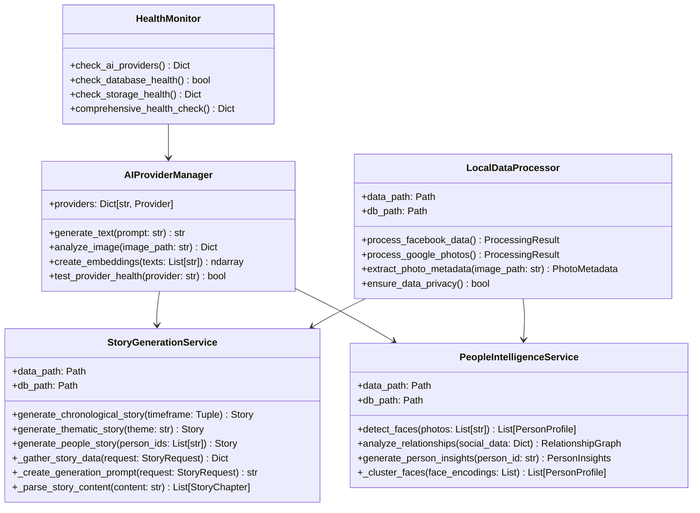
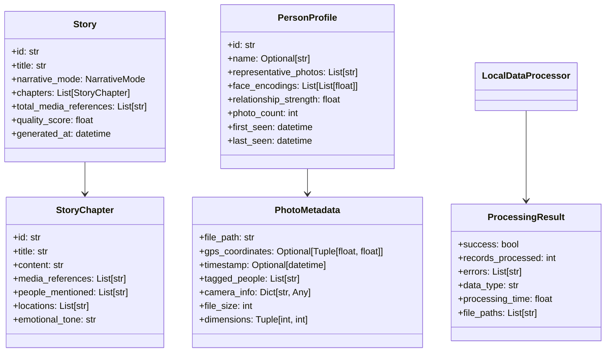
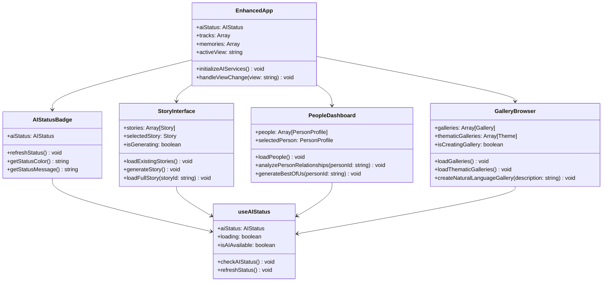
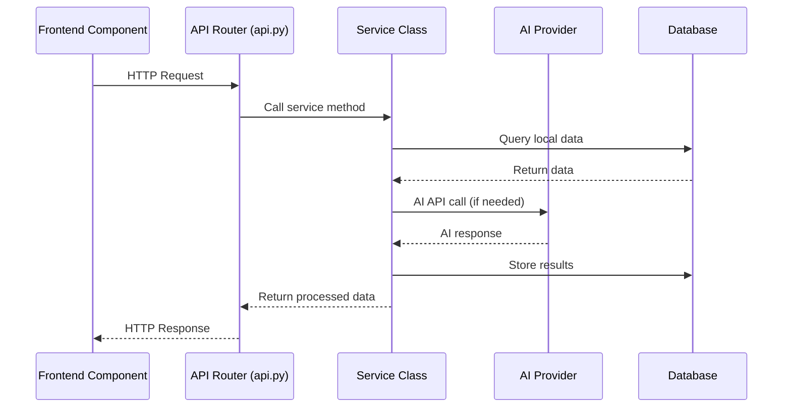
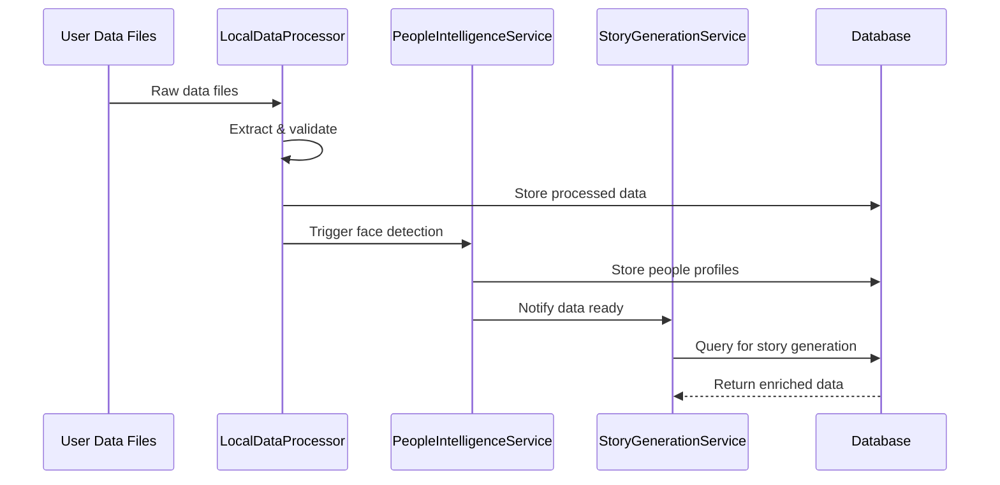

# Class Diagrams - AI Personal Archive

## 🏗️ Core Class Structure

### AI Services Class Hierarchy



### Data Models



### Frontend Component Hierarchy



## 🔄 Service Interaction Patterns

### API Request Flow



### Data Processing Flow



## 🎯 Key Design Patterns

### 1. Service Layer Pattern
```python
# Each major functionality is encapsulated in a service class
class StoryGenerationService:
    def __init__(self, data_path: str):
        self.data_path = Path(data_path)
        self._init_database()
    
    async def generate_story(self, request: StoryRequest) -> Story:
        # Business logic here
        pass
```

### 2. Provider Pattern
```python
# AI providers are abstracted behind a common interface
class AIProviderManager:
    def __init__(self):
        self.providers = {
            'openai': OpenAIProvider(),
            'anthropic': AnthropicProvider(),
            'google': GoogleProvider()
        }
    
    async def generate_text(self, prompt: str) -> str:
        # Try providers in order of preference
        pass
```

### 3. Repository Pattern
```python
# Data access is abstracted through repository-like methods
class LocalDataProcessor:
    def process_facebook_data(self) -> ProcessingResult:
        # Data processing logic
        pass
    
    def extract_photo_metadata(self, image_path: str) -> PhotoMetadata:
        # Metadata extraction logic
        pass
```

### 4. Hook Pattern (Frontend)
```javascript
// Custom hooks encapsulate stateful logic
function useAIStatus() {
    const [aiStatus, setAiStatus] = useState(initialState);
    
    const checkAIStatus = async () => {
        // Status checking logic
    };
    
    return { aiStatus, checkAIStatus, isAIAvailable };
}
```

## 🔧 Extension Points

### Adding New AI Provider
1. Create provider class implementing common interface
2. Add to `AIProviderManager.providers` dict
3. Update configuration in `config.py`
4. Add tests in `tests/unit/test_ai_providers.py`

### Adding New Data Source
1. Add processing method to `LocalDataProcessor`
2. Create data model classes if needed
3. Update database schema if required
4. Add tests in `tests/test_data_processing.py`

### Adding New Frontend Component
1. Create component in `src/frontend/src/components/`
2. Add to `EnhancedApp.js` routing/navigation
3. Create corresponding CSS file
4. Add tests in `tests/component/`

### Adding New API Endpoint
1. Add route to `src/ai_services/api.py`
2. Implement business logic in appropriate service class
3. Add request/response models using Pydantic
4. Add tests in `tests/integration/test_api_endpoints.py`