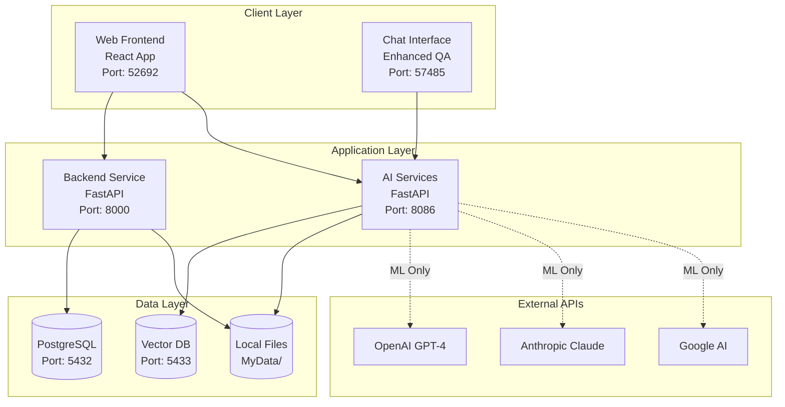
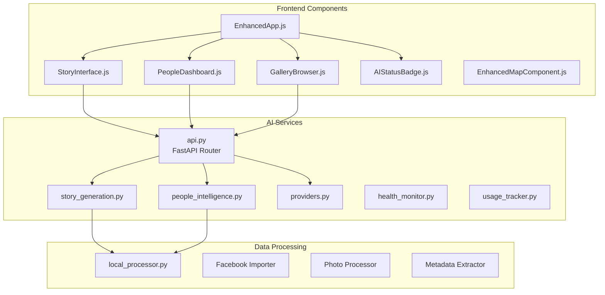
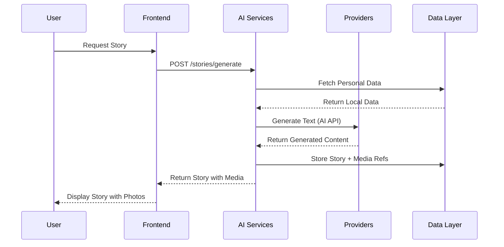
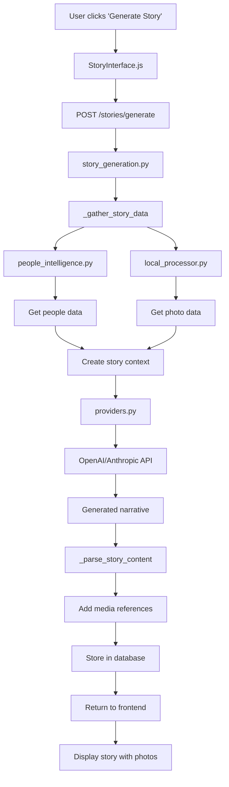
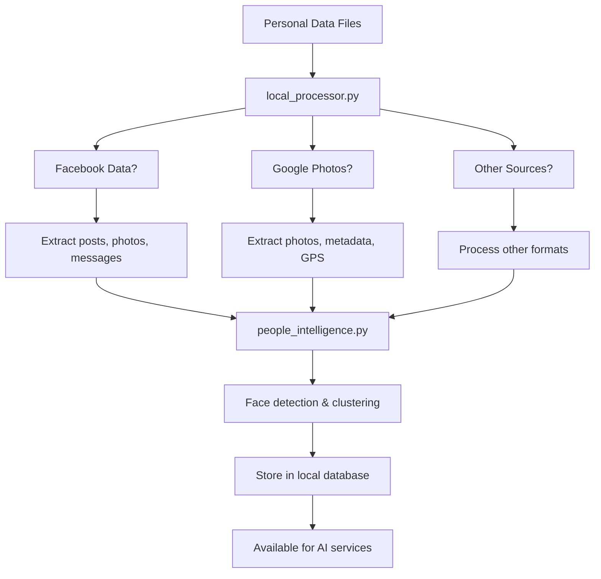

# AI-Augmented Personal Archive - Development Guide

## 📋 Table of Contents
1. [System Overview](#system-overview)
2. [Architecture Diagrams](#architecture-diagrams)
3. [Tech Stack](#tech-stack)
4. [Component Structure](#component-structure)
5. [Functionality Map](#functionality-map)
6. [Data Flow](#data-flow)
7. [Development Workflow](#development-workflow)
8. [Troubleshooting Guide](#troubleshooting-guide)

---

## 🏗️ System Overview

The AI-Augmented Personal Archive is a multi-service application that processes personal data locally while leveraging cloud AI APIs for machine learning functionality. The system maintains privacy by keeping all personal data local and only sending processed/anonymized data to AI providers.

### Core Principles
- **Privacy First**: All personal data stays local
- **AI-Augmented**: Cloud AI for ML, local processing for data
- **Modular Design**: Microservices architecture with clear boundaries
- **Graceful Degradation**: Works with or without AI providers

---

## 🏛️ Architecture Diagrams

### High-Level System Architecture



### Component Architecture



### Data Flow Architecture



---

## 🛠️ Tech Stack

### Frontend Stack
```
React 18.2.0          # UI Framework
PrimeReact 10.0.0     # UI Component Library
React Router 6.x      # Client-side routing
Axios                 # HTTP client
React Hooks           # State management
CSS3 + Flexbox        # Styling
```

### Backend Stack
```
Python 3.11+          # Runtime
FastAPI 0.104.1       # Web framework
SQLite 3              # Local database
PostgreSQL 15         # Main database
pgvector              # Vector database
Pydantic              # Data validation
asyncio               # Async processing
```

### AI & ML Stack
```
OpenAI API            # GPT-4, embeddings
Anthropic API         # Claude-3
Google AI API         # Gemini
Pillow (PIL)          # Image processing
NumPy                 # Numerical computing
```

### DevOps Stack
```
Docker Compose        # Container orchestration
UV Package Manager    # Python dependency management
pytest                # Testing framework
GitHub Actions        # CI/CD (future)
```

---

## 🧩 Component Structure

### Frontend Components (`src/frontend/src/`)

```
src/frontend/src/
├── components/
│   ├── AIStatusBadge.js        # Real-time AI service status
│   ├── StoryInterface.js       # Story generation & display
│   ├── PeopleDashboard.js      # People detection & relationships
│   ├── GalleryBrowser.js       # Photo galleries & curation
│   ├── EnhancedMapComponent.js # Location-based narratives
│   ├── DisabledFeature.js      # Graceful feature degradation
│   └── ErrorBoundary.js        # Error handling wrapper
├── hooks/
│   └── useAIStatus.js          # AI service status hook
├── service/
│   └── DigitalDataImportor.js  # Data import utilities
├── App.js                      # Legacy app component
├── EnhancedApp.js             # Main AI-augmented app
├── Constants.js               # Configuration constants
└── index.js                   # Application entry point
```

### Backend Services (`src/`)

```
src/
├── ai_services/
│   ├── api.py                 # FastAPI routes & endpoints
│   ├── story_generation.py   # AI story creation service
│   ├── people_intelligence.py # Face detection & relationships
│   ├── providers.py           # AI provider management
│   ├── health_monitor.py      # System health monitoring
│   ├── usage_tracker.py       # API usage tracking
│   ├── config.py             # Configuration management
│   └── local_models.py       # Local AI model integration
├── data_processing/
│   └── local_processor.py    # Personal data processing
├── qa/
│   └── enhanced_qa_server.py # Q&A service with RAG
└── ingest/
    └── [data importers]       # Facebook, Google Photos, etc.
```

---

## 🗺️ Functionality Map

### Core Features & Locations

| Feature | Frontend Component | Backend Service | Database Tables |
|---------|-------------------|-----------------|-----------------|
| **Story Generation** | `StoryInterface.js` | `story_generation.py` | `stories`, `story_chapters` |
| **People Detection** | `PeopleDashboard.js` | `people_intelligence.py` | `people`, `face_detections` |
| **Photo Galleries** | `GalleryBrowser.js` | `api.py` `/galleries` | `galleries`, `photos` |
| **AI Status** | `AIStatusBadge.js` | `health_monitor.py` | `api_usage` |
| **Chat/Q&A** | Terminal component | `enhanced_qa_server.py` | `memories`, `embeddings` |
| **Data Import** | `DigitalDataImportor.js` | `local_processor.py` | `processed_files` |
| **Maps/Places** | `EnhancedMapComponent.js` | `api.py` `/places` | `locations` |

### API Endpoints Map

```
AI Services (Port 8086):
├── GET  /health              # System health check
├── GET  /status              # AI provider status
├── GET  /stories             # List all stories
├── POST /stories/generate    # Generate new story
├── GET  /stories/{id}        # Get specific story
├── GET  /people              # List detected people
├── GET  /galleries           # List photo galleries
├── GET  /places              # List locations
├── POST /chat                # Chat interface
└── POST /qa                  # Q&A interface

Backend (Port 8000):
├── GET  /api/data            # Data import status
├── POST /api/import          # Trigger data import
└── GET  /api/health          # Backend health

QA Service (Port 57485):
├── GET  /                    # Chat interface
└── POST /query               # Process Q&A queries
```

---

## 🔄 Data Flow

### Story Generation Flow



### Data Processing Flow



---

## 🔧 Development Workflow

### Making Changes

#### 1. Frontend Changes
```bash
# Location: src/frontend/src/
# For UI changes, component updates, or styling

# Example: Adding a new feature to StoryInterface
1. Edit: src/frontend/src/components/StoryInterface.js
2. Test: cd src/frontend && npm test
3. View: http://localhost:52692
```

#### 2. AI Service Changes
```bash
# Location: src/ai_services/
# For API endpoints, AI logic, or data processing

# Example: Adding a new story generation mode
1. Edit: src/ai_services/story_generation.py
2. Update: src/ai_services/api.py (add endpoint)
3. Test: python -m pytest tests/unit/test_story_generation.py
4. Restart: docker compose restart ai-services
```

#### 3. Data Processing Changes
```bash
# Location: src/data_processing/
# For data import, processing, or storage logic

# Example: Adding a new data source
1. Edit: src/data_processing/local_processor.py
2. Add: New processing method
3. Test: python -m pytest tests/test_data_processing.py
4. Restart: docker compose restart backend
```

### Testing Strategy

```bash
# Unit Tests - Test individual components
python -m pytest tests/unit/ -v

# Integration Tests - Test service interactions
python -m pytest tests/integration/ -v

# Component Tests - Test frontend components
cd src/frontend && npm test

# End-to-End Tests - Test full user workflows
python -m pytest tests/e2e/ -v

# Manual Testing - Use HTML test tools
open tools/browser_functionality_test.html
```

### Debugging Workflow

```bash
# 1. Check service status
docker compose ps

# 2. View logs
docker compose logs -f ai-services
docker compose logs -f frontend

# 3. Test API endpoints
curl http://localhost:8086/health
curl http://localhost:8086/stories

# 4. Use debug tools
python tools/debug_openai_error.py
open tools/test_frontend_functionality.html
```

---

## 🚨 Troubleshooting Guide

### Common Issues & Solutions

#### Frontend Not Loading Data
```bash
# Symptoms: Empty stories, people, galleries
# Location: src/frontend/src/components/

# Check 1: API connectivity
curl http://localhost:8086/stories

# Check 2: Component data loading
# Edit: StoryInterface.js, PeopleDashboard.js, GalleryBrowser.js
# Look for: useEffect hooks, API calls, error handling

# Fix: Ensure components call correct endpoints on mount
```

#### AI Services Not Working
```bash
# Symptoms: Generic responses, no AI features
# Location: src/ai_services/

# Check 1: API keys configured
cat .env | grep API_KEY

# Check 2: Provider status
curl http://localhost:8086/status

# Check 3: Service logs
docker compose logs ai-services

# Fix: Add API keys, restart services
```

#### Stories Have No Media
```bash
# Symptoms: Stories generate but no photos
# Location: src/ai_services/story_generation.py

# Check: _gather_story_data method
# Check: _extract_media_references method
# Fix: Ensure real data connection, not mock data
```

#### Data Not Processing
```bash
# Symptoms: No people detected, no photos imported
# Location: src/data_processing/local_processor.py

# Check 1: Data directory exists
ls -la MyData/

# Check 2: Processing logs
docker compose logs backend

# Fix: Ensure data files in correct format and location
```

### Performance Issues

#### Slow Story Generation
```bash
# Location: src/ai_services/story_generation.py
# Optimize: Reduce data gathering scope
# Optimize: Cache AI responses
# Optimize: Limit photo processing
```

#### High Memory Usage
```bash
# Location: src/ai_services/people_intelligence.py
# Optimize: Process photos in batches
# Optimize: Limit face encoding storage
# Optimize: Use smaller image sizes
```

### Configuration Issues

#### Docker Services Not Starting
```bash
# Check: docker-compose.yml
# Check: Dockerfile configurations
# Fix: Ensure ports not in use, volumes mounted correctly
```

#### Environment Variables
```bash
# Check: .env file exists and has correct format
# Check: docker-compose.yml env_file references
# Fix: Copy from .env.example, add real API keys
```

---

## 📚 Key Files Reference

### Must-Know Files for Development

| File | Purpose | When to Edit |
|------|---------|--------------|
| `src/ai_services/api.py` | Main API router | Adding new endpoints |
| `src/ai_services/story_generation.py` | Story creation logic | Changing story generation |
| `src/frontend/src/components/StoryInterface.js` | Story UI | Changing story display |
| `src/frontend/src/hooks/useAIStatus.js` | AI status monitoring | Changing status logic |
| `docker-compose.yml` | Service orchestration | Adding services, changing ports |
| `.env.example` | Configuration template | Adding new config options |

### Configuration Files

| File | Purpose | Contains |
|------|---------|----------|
| `pyproject.toml` | Python dependencies | Package versions, build config |
| `uv.lock` | Dependency lock file | Exact versions for reproducible builds |
| `config/ingest.conf` | Data processing config | Import settings, file paths |
| `src/frontend/package.json` | Frontend dependencies | React packages, scripts |

---

## 🎯 Development Tips

### Best Practices

1. **Always test locally first**
   ```bash
   # Start services
   ./start_app.sh
   
   # Run tests
   python tests/run_all_tests.py
   ```

2. **Use the debug tools**
   ```bash
   # HTML testing interfaces
   open tools/browser_functionality_test.html
   
   # Python debug scripts
   python tools/debug_openai_error.py
   ```

3. **Check logs when things break**
   ```bash
   docker compose logs -f [service-name]
   ```

4. **Understand the data flow**
   - Personal data → local_processor.py → database
   - Database → AI services → AI providers → generated content
   - Generated content → frontend → user

5. **Respect the privacy model**
   - Personal data stays local
   - Only processed/anonymized data goes to AI APIs
   - Always check what data is being sent externally

This guide should give you a comprehensive understanding of the codebase structure and how to navigate it effectively for development!