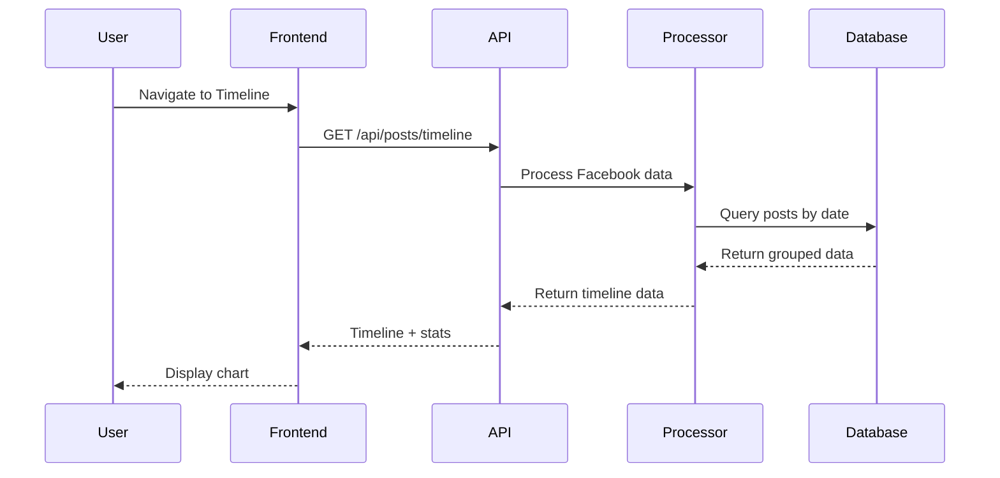
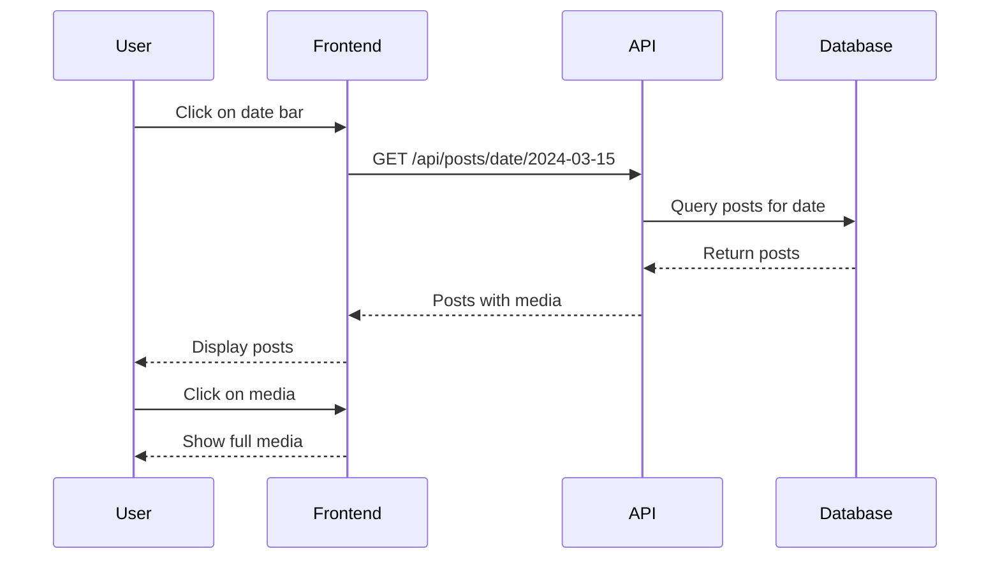

# Facebook Posts Timeline - Feature Specification

## 🎯 **Feature Overview**

Create a modern, interactive timeline visualization for Facebook posts that resembles Airbnb/Booking.com price graphs, where:
- **X-axis**: Dates
- **Y-axis**: Number of posts per date (height of columns)
- **Interaction**: Click on date → view posts for that day
- **Media Support**: Display posts with photos/attachments

## 📊 **Current Data Analysis**

### Data Source: `MyData/facebook/posts.json`
```json
{
  "posts_v2": [
    {
      "timestamp": 1765205072,
      "data": [{"post": "Had an amazing day at the beach..."}],
      "attachments": [{"data": [{"media": {"uri": "photos/photo_beach_4.jpg"}}]}]
    }
  ]
}
```

### Data Structure:
- **176 posts** currently imported
- **Timestamp**: Unix timestamp for date grouping
- **Content**: Post text in `data[0].post`
- **Media**: Photos in `attachments[].data[].media.uri`

## 🏗️ **Architecture Design**

### Backend Components

```mermaid
graph TB
    subgraph "New Components"
        POSTS_API[posts_timeline.py<br/>FastAPI Service]
        POSTS_PROC[facebook_posts_processor.py<br/>Data Processing]
        POSTS_MODEL[timeline_models.py<br/>Data Models]
    end
    
    subgraph "Frontend Components"
        TIMELINE[TimelineChart.js<br/>Chart Component]
        POSTS_VIEW[PostsViewer.js<br/>Posts Display]
        DATE_PICKER[DateRangePicker.js<br/>Date Selection]
    end
    
    subgraph "Data Flow"
        JSON[MyData/facebook/posts.json]
        DB[(Local Database)]
        API[/api/posts/timeline]
    end
    
    JSON --> POSTS_PROC
    POSTS_PROC --> DB
    DB --> POSTS_API
    POSTS_API --> API
    API --> TIMELINE
    TIMELINE --> POSTS_VIEW
    DATE_PICKER --> TIMELINE
```

## 🔧 **Implementation Plan**

### **Step 1: Backend Data Processing**
1. Create `src/ai_services/facebook_posts_processor.py`
2. Parse Facebook posts JSON
3. Group posts by date
4. Extract media references
5. Store in database

### **Step 2: API Endpoints**
1. `GET /api/posts/timeline` - Get posts grouped by date
2. `GET /api/posts/date/{date}` - Get posts for specific date
3. `GET /api/posts/stats` - Get overall statistics

### **Step 3: Frontend Components**
1. Create timeline chart component (Chart.js or D3.js)
2. Create posts viewer component
3. Create date range picker
4. Integrate with main app

### **Step 4: Integration**
1. Add to main navigation
2. Connect to existing photo viewer
3. Add to AI services for story generation

## 📋 **Detailed Requirements**

### **Backend Requirements**

#### Data Models
```python
@dataclass
class FacebookPost:
    id: str
    timestamp: int
    date: str  # YYYY-MM-DD
    content: str
    media_uris: List[str]
    has_media: bool

@dataclass
class TimelineData:
    date: str
    post_count: int
    posts: List[FacebookPost]

@dataclass
class TimelineStats:
    total_posts: int
    date_range: Tuple[str, str]
    posts_with_media: int
    most_active_date: str
```

#### API Endpoints
```python
# Get timeline data for chart
GET /api/posts/timeline
Response: {
    "timeline": [
        {"date": "2024-01-15", "post_count": 3},
        {"date": "2024-01-16", "post_count": 1}
    ],
    "stats": {
        "total_posts": 176,
        "date_range": ["2023-01-01", "2024-12-31"],
        "posts_with_media": 89
    }
}

# Get posts for specific date
GET /api/posts/date/2024-01-15
Response: {
    "date": "2024-01-15",
    "posts": [
        {
            "id": "post_123",
            "timestamp": 1705334400,
            "content": "Had an amazing day...",
            "media_uris": ["photos/beach.jpg"],
            "has_media": true
        }
    ]
}

# Get date range with posts
GET /api/posts/timeline?start_date=2024-01-01&end_date=2024-01-31
```

### **Frontend Requirements**

#### Timeline Chart Component
```javascript
// TimelineChart.js
const TimelineChart = ({ 
    timelineData, 
    onDateClick, 
    selectedDateRange,
    onDateRangeChange 
}) => {
    // Chart.js bar chart
    // X-axis: dates
    // Y-axis: post count
    // Interactive: click to select date
    // Zoom: date range selection
}
```

#### Posts Viewer Component
```javascript
// PostsViewer.js
const PostsViewer = ({ 
    selectedDate, 
    posts, 
    onMediaClick 
}) => {
    // Display posts for selected date
    // Show post content
    // Display media thumbnails
    // Click to view full media
}
```

#### Date Range Picker
```javascript
// DateRangePicker.js
const DateRangePicker = ({ 
    dateRange, 
    onRangeChange,
    availableDates 
}) => {
    // Calendar-style date picker
    // Highlight dates with posts
    // Range selection support
}
```

## 🎨 **UI/UX Design**

### Layout Structure
```
┌─────────────────────────────────────────────────────────┐
│ Facebook Posts Timeline                                 │
├─────────────────────────────────────────────────────────┤
│ [Date Range Picker] [Stats: 176 posts, 89 with media] │
├─────────────────────────────────────────────────────────┤
│                                                         │
│  Posts                                                  │
│    │                                                    │
│  5 ┤     ██                                             │
│    │     ██                                             │
│  3 ┤  ██ ██    ██                                       │
│    │  ██ ██    ██                                       │
│  1 ┤  ██ ██ ██ ██ ██    ██                             │
│    └──┴──┴──┴──┴──┴──┴──┴──────────────────────────────│
│     Jan Feb Mar Apr May Jun Jul                        │
│                                                         │
├─────────────────────────────────────────────────────────┤
│ Selected Date: March 15, 2024 (3 posts)               │
├─────────────────────────────────────────────────────────┤
│ ┌─────────────────────────────────────────────────────┐ │
│ │ 📅 March 15, 2024 - 2:30 PM                       │ │
│ │ Had an amazing day at the beach with friends! 🏖️   │ │
│ │ [📷 beach_photo.jpg]                               │ │
│ └─────────────────────────────────────────────────────┘ │
│ ┌─────────────────────────────────────────────────────┐ │
│ │ 📅 March 15, 2024 - 6:45 PM                       │ │
│ │ Sunset was incredible today! 🌅                    │ │
│ │ [📷 sunset.jpg] [📷 friends.jpg]                   │ │
│ └─────────────────────────────────────────────────────┘ │
└─────────────────────────────────────────────────────────┘
```

### Visual Design Elements
- **Chart Style**: Similar to Airbnb price charts
- **Color Scheme**: Blue bars for posts, darker blue for selected
- **Hover Effects**: Show post count and date on hover
- **Media Indicators**: Small icons for posts with photos
- **Responsive**: Works on mobile and desktop

## 🔄 **Data Flow**

### Initialization Flow


### Interaction Flow


## 🧪 **Testing Strategy**

### Backend Tests
```python
# tests/unit/test_facebook_posts_processor.py
def test_parse_facebook_posts():
    # Test JSON parsing
    # Test date grouping
    # Test media extraction

# tests/integration/test_posts_timeline_api.py
def test_timeline_endpoint():
    # Test API responses
    # Test date filtering
    # Test error handling
```

### Frontend Tests
```javascript
// tests/component/test_timeline_chart.js
describe('TimelineChart', () => {
    test('renders chart with data', () => {});
    test('handles date clicks', () => {});
    test('updates on date range change', () => {});
});
```

## 📈 **Performance Considerations**

### Backend Optimization
- **Caching**: Cache timeline data for 1 hour
- **Pagination**: Limit posts per date to 50
- **Indexing**: Database index on date field
- **Lazy Loading**: Load media URIs only when needed

### Frontend Optimization
- **Virtual Scrolling**: For large post lists
- **Image Lazy Loading**: Load media on demand
- **Chart Optimization**: Use Canvas for large datasets
- **Debounced Interactions**: Prevent excessive API calls

## 🚀 **Future Enhancements**

### Phase 2 Features
- **Search**: Search posts by content
- **Filters**: Filter by media type, content length
- **Export**: Export timeline data as CSV/JSON
- **Sharing**: Share specific date ranges

### Phase 3 Features
- **AI Integration**: Generate stories from date ranges
- **Sentiment Analysis**: Color-code posts by sentiment
- **Location Integration**: Show posts on map
- **Social Network**: Show interactions with friends

## 📋 **Implementation Checklist**

### Backend Tasks
- [ ] Create `facebook_posts_processor.py`
- [ ] Create database models and tables
- [ ] Implement timeline API endpoints
- [ ] Add data processing for existing posts
- [ ] Write unit and integration tests

### Frontend Tasks
- [ ] Create `TimelineChart.js` component
- [ ] Create `PostsViewer.js` component
- [ ] Create `DateRangePicker.js` component
- [ ] Integrate with main navigation
- [ ] Add responsive design
- [ ] Write component tests

### Integration Tasks
- [ ] Connect to existing photo viewer
- [ ] Add to AI story generation context
- [ ] Update main app routing
- [ ] Add to health monitoring
- [ ] Update documentation

This specification provides a complete roadmap for implementing the Facebook Posts Timeline feature with modern, intuitive visualization similar to popular booking platforms.